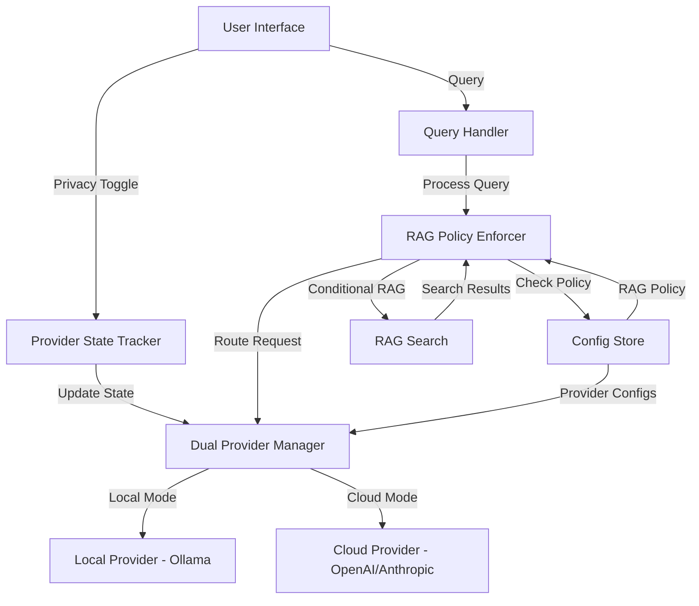

# Design Document: Cloud AI Privacy Controls

## Overview

This feature transforms Noodexx's AI provider configuration from a single-provider model to a dual-provider architecture with granular privacy controls. The design enables users to configure both a local AI provider (Ollama) and a cloud AI provider (OpenAI/Anthropic) simultaneously, switching between them via a privacy toggle in the UI. Additionally, administrators gain control over whether document context (RAG) is shared with cloud providers through a configurable policy setting.

The key innovation is the separation of provider configuration from provider selection, allowing seamless switching without reconfiguration. This addresses the common use case where users want the privacy of local AI for sensitive queries but the power of cloud AI for general questions.

### Design Goals

1. **Zero-friction provider switching**: Users can toggle between local and cloud AI in under 1 second without navigating to settings
2. **Granular privacy control**: Administrators can enforce whether RAG context is sent to cloud providers
3. **Backward compatibility**: Existing single-provider configurations continue to work without migration
4. **Clear visual feedback**: Users always know which provider is active and whether RAG is enabled
5. **Configuration persistence**: All settings survive application restarts

### Non-Goals

- Multi-provider load balancing or failover
- Per-user RAG policy configuration (admin-only setting)
- Provider-specific RAG policies (policy applies to all cloud providers)
- Real-time provider health monitoring

## Architecture

### High-Level Architecture

The design introduces three new architectural components:

1. **Dual Provider Manager**: Manages two provider instances (local and cloud) and routes requests based on privacy toggle state
2. **RAG Policy Enforcer**: Intercepts query processing to conditionally enable/disable RAG based on active provider and policy
3. **Provider State Tracker**: Maintains current provider selection and synchronizes with UI



### Configuration Model Changes

The current configuration model uses a single `ProviderConfig` with a `Type` field that determines which provider is active. This design extends the model to support dual providers:

**Current Model:**
```go
type Config struct {
    Provider   ProviderConfig   // Single provider config
    Privacy    PrivacyConfig    // Boolean privacy mode
    // ... other fields
}

type ProviderConfig struct {
    Type string // "ollama", "openai", "anthropic"
    // All provider fields mixed together
}
```

**New Model:**
```go
type Config struct {
    LocalProvider  ProviderConfig   // Local AI configuration
    CloudProvider  ProviderConfig   // Cloud AI configuration
    Privacy        PrivacyConfig    // Privacy toggle state + RAG policy
    // ... other fields
}

type ProviderConfig struct {
    Type string // "ollama", "openai", "anthropic"
    // Provider-specific fields
}

type PrivacyConfig struct {
    UseLocalAI      bool   // Privacy toggle state (true = local, false = cloud)
    CloudRAGPolicy  string // "no_rag" or "allow_rag"
}
```

### Request Flow

#### Local AI Mode (Privacy Toggle = Local)
1. User submits query via UI
2. Query Handler checks Privacy.UseLocalAI → true
3. RAG Policy Enforcer: Always perform RAG (policy ignored)
4. RAG Search executes and retrieves document chunks
5. Dual Provider Manager routes to Local Provider
6. Response streams back to UI with "Local AI" indicator

#### Cloud AI Mode with No RAG Policy
1. User submits query via UI
2. Query Handler checks Privacy.UseLocalAI → false
3. RAG Policy Enforcer checks CloudRAGPolicy → "no_rag"
4. RAG Search is SKIPPED
5. Dual Provider Manager routes to Cloud Provider with query only
6. Response streams back to UI with "Cloud AI (No RAG)" indicator

#### Cloud AI Mode with Allow RAG Policy
1. User submits query via UI
2. Query Handler checks Privacy.UseLocalAI → false
3. RAG Policy Enforcer checks CloudRAGPolicy → "allow_rag"
4. RAG Search executes and retrieves document chunks
5. Dual Provider Manager routes to Cloud Provider with query + context
6. Response streams back to UI with "Cloud AI (RAG Enabled)" indicator

## Components and Interfaces

### 1. Dual Provider Manager

**Responsibility**: Manages two provider instances and routes requests based on privacy toggle state.

**Interface:**
```go
type DualProviderManager struct {
    localProvider  llm.Provider
    cloudProvider  llm.Provider
    config         *config.Config
    logger         *logging.Logger
}

// NewDualProviderManager creates a manager with both providers
func NewDualProviderManager(cfg *config.Config, logger *logging.Logger) (*DualProviderManager, error)

// GetActiveProvider returns the currently active provider based on privacy toggle
func (m *DualProviderManager) GetActiveProvider() (llm.Provider, error)

// IsLocalMode returns true if privacy toggle is set to local AI
func (m *DualProviderManager) IsLocalMode() bool

// GetProviderName returns the name of the active provider for UI display
func (m *DualProviderManager) GetProviderName() string

// Reload reinitializes providers after configuration changes
func (m *DualProviderManager) Reload(cfg *config.Config) error
```

**Key Behaviors:**
- Initializes both local and cloud providers at startup (if configured)
- Returns appropriate provider based on `Privacy.UseLocalAI` flag
- Handles cases where a provider is not configured (returns error)
- Supports hot-reload when configuration changes

### 2. RAG Policy Enforcer

**Responsibility**: Determines whether RAG should be performed based on active provider and policy.

**Interface:**
```go
type RAGPolicyEnforcer struct {
    config *config.Config
    logger *logging.Logger
}

// NewRAGPolicyEnforcer creates a new enforcer
func NewRAGPolicyEnforcer(cfg *config.Config, logger *logging.Logger) *RAGPolicyEnforcer

// ShouldPerformRAG returns true if RAG should be executed for the current request
func (e *RAGPolicyEnforcer) ShouldPerformRAG() bool

// GetRAGStatus returns a status string for UI display
// Returns: "RAG Enabled", "RAG Disabled (Cloud Policy)", or "RAG Enabled (Local)"
func (e *RAGPolicyEnforcer) GetRAGStatus() string
```

**Decision Logic:**
```
IF Privacy.UseLocalAI == true:
    RETURN true  // Always perform RAG with local AI

IF Privacy.UseLocalAI == false:
    IF Privacy.CloudRAGPolicy == "allow_rag":
        RETURN true  // Perform RAG with cloud AI
    ELSE:
        RETURN false  // Skip RAG with cloud AI
```

### 3. Modified Query Handler

The existing `handleAsk` function in `internal/api/handlers.go` needs modification to integrate RAG policy enforcement:

**Current Flow:**
```go
func (s *Server) handleAsk(w http.ResponseWriter, r *http.Request) {
    // ... authentication and parsing ...
    
    // Always embed and search
    queryVec, _ := s.provider.Embed(ctx, req.Query)
    chunks, _ := s.store.SearchByUser(ctx, userID, queryVec, 5)
    
    // Always build prompt with chunks
    prompt := promptBuilder.BuildPrompt(req.Query, chunks)
    
    // Stream response
    response, _ := s.provider.Stream(ctx, messages, w)
}
```

**New Flow:**
```go
func (s *Server) handleAsk(w http.ResponseWriter, r *http.Request) {
    // ... authentication and parsing ...
    
    // Get active provider
    provider, err := s.providerManager.GetActiveProvider()
    if err != nil {
        // Handle unconfigured provider error
    }
    
    // Check if RAG should be performed
    var chunks []Chunk
    if s.ragEnforcer.ShouldPerformRAG() {
        queryVec, _ := provider.Embed(ctx, req.Query)
        chunks, _ = s.store.SearchByUser(ctx, userID, queryVec, 5)
    }
    
    // Build prompt (with or without chunks)
    prompt := promptBuilder.BuildPrompt(req.Query, chunks)
    
    // Add provider and RAG status to response headers
    w.Header().Set("X-Provider-Name", s.providerManager.GetProviderName())
    w.Header().Set("X-RAG-Status", s.ragEnforcer.GetRAGStatus())
    
    // Stream response
    response, _ := provider.Stream(ctx, messages, w)
}
```

### 4. Settings Handler Modifications

The settings handler needs to support saving dual provider configurations:

**New Endpoint Behavior:**
```go
func (s *Server) handleConfig(w http.ResponseWriter, r *http.Request) {
    // Parse form data for BOTH providers
    localConfig := ProviderConfig{
        Type:             r.FormValue("local_provider_type"),
        OllamaEndpoint:   r.FormValue("local_ollama_endpoint"),
        // ... other local fields
    }
    
    cloudConfig := ProviderConfig{
        Type:           r.FormValue("cloud_provider_type"),
        OpenAIKey:      r.FormValue("cloud_openai_key"),
        AnthropicKey:   r.FormValue("cloud_anthropic_key"),
        // ... other cloud fields
    }
    
    privacyConfig := PrivacyConfig{
        UseLocalAI:     r.FormValue("use_local_ai") == "true",
        CloudRAGPolicy: r.FormValue("cloud_rag_policy"), // "no_rag" or "allow_rag"
    }
    
    // Update config
    s.config.LocalProvider = localConfig
    s.config.CloudProvider = cloudConfig
    s.config.Privacy = privacyConfig
    
    // Save to disk
    s.config.Save(s.configPath)
    
    // Reload providers
    s.providerManager.Reload(s.config)
}
```

### 5. UI Components

#### Privacy Toggle (Sidebar)

**Location**: Chat sidebar, prominently displayed above chat input

**Visual Design:**
```
┌─────────────────────────────────┐
│  ○ Local AI    ● Cloud AI       │  ← Toggle switch
│  🔒 Private    ☁️ Powerful       │  ← Icons and labels
└─────────────────────────────────┘
```

**Behavior:**
- Clicking toggles between local and cloud mode
- Sends POST request to `/api/privacy-toggle` endpoint
- Updates immediately without page reload
- Disabled if selected provider is not configured

**Implementation:**
```html
<div class="privacy-toggle">
    <label class="toggle-switch">
        <input type="radio" name="provider-mode" value="local" 
               onchange="switchProvider('local')" checked>
        <span>🔒 Local AI</span>
    </label>
    <label class="toggle-switch">
        <input type="radio" name="provider-mode" value="cloud"
               onchange="switchProvider('cloud')">
        <span>☁️ Cloud AI</span>
    </label>
</div>
```

#### Active Provider Indicator (Chat Interface)

**Location**: Top of chat interface, next to session title

**Visual Design:**
```
┌─────────────────────────────────────────────┐
│ 💬 Chat Session                             │
│ Using: Local AI (Ollama) | RAG: Enabled     │  ← Status line
└─────────────────────────────────────────────┘
```

**Behavior:**
- Updates automatically when provider switches
- Shows provider name (e.g., "Local AI (Ollama)", "Cloud AI (GPT-4)")
- Shows RAG status (e.g., "RAG: Enabled", "RAG: Disabled")
- Color-coded: green for local, blue for cloud

#### Settings Page - Dual Provider Sections

**Layout:**
```
Settings
├── Privacy Controls
│   ├── Default Provider: [Local AI ▼]
│   └── Cloud AI RAG Policy: [No RAG ▼] (Admin only)
│
├── Local AI Provider
│   ├── Provider Type: [Ollama ▼]
│   ├── Endpoint: [http://localhost:11434]
│   ├── Embed Model: [nomic-embed-text]
│   └── Chat Model: [llama3.2]
│
└── Cloud AI Provider
    ├── Provider Type: [OpenAI ▼]
    ├── API Key: [••••••••]
    ├── Embed Model: [text-embedding-3-small ▼]
    └── Chat Model: [gpt-4 ▼]
```

**Key Changes:**
1. Split provider configuration into two sections
2. Add "Privacy Controls" section at top with:
   - Default provider selection (persisted as Privacy.UseLocalAI)
   - Cloud RAG Policy dropdown (admin-only, persisted as Privacy.CloudRAGPolicy)
3. Each provider section is independently configurable
4. Test connection button for each provider

## Data Models

### Configuration Schema

**Updated Config Structure:**
```go
type Config struct {
    LocalProvider  ProviderConfig   `json:"local_provider"`
    CloudProvider  ProviderConfig   `json:"cloud_provider"`
    Privacy        PrivacyConfig    `json:"privacy"`
    Folders        []string         `json:"folders"`
    Logging        LoggingConfig    `json:"logging"`
    Guardrails     GuardrailsConfig `json:"guardrails"`
    Server         ServerConfig     `json:"server"`
    UserMode       string           `json:"user_mode"`
    Auth           AuthConfig       `json:"auth"`
}

type ProviderConfig struct {
    Type                string `json:"type"` // "ollama", "openai", "anthropic", or "" (not configured)
    OllamaEndpoint      string `json:"ollama_endpoint,omitempty"`
    OllamaEmbedModel    string `json:"ollama_embed_model,omitempty"`
    OllamaChatModel     string `json:"ollama_chat_model,omitempty"`
    OpenAIKey           string `json:"openai_key,omitempty"`
    OpenAIEmbedModel    string `json:"openai_embed_model,omitempty"`
    OpenAIChatModel     string `json:"openai_chat_model,omitempty"`
    AnthropicKey        string `json:"anthropic_key,omitempty"`
    AnthropicEmbedModel string `json:"anthropic_embed_model,omitempty"`
    AnthropicChatModel  string `json:"anthropic_chat_model,omitempty"`
}

type PrivacyConfig struct {
    UseLocalAI     bool   `json:"use_local_ai"`      // Privacy toggle state
    CloudRAGPolicy string `json:"cloud_rag_policy"`  // "no_rag" or "allow_rag"
}
```

**Example config.json:**
```json
{
  "local_provider": {
    "type": "ollama",
    "ollama_endpoint": "http://localhost:11434",
    "ollama_embed_model": "nomic-embed-text",
    "ollama_chat_model": "llama3.2"
  },
  "cloud_provider": {
    "type": "openai",
    "openai_key": "sk-...",
    "openai_embed_model": "text-embedding-3-small",
    "openai_chat_model": "gpt-4"
  },
  "privacy": {
    "use_local_ai": true,
    "cloud_rag_policy": "no_rag"
  },
  "folders": [],
  "logging": { ... },
  "guardrails": { ... },
  "server": { ... },
  "user_mode": "multi",
  "auth": { ... }
}
```

### Migration Strategy

To maintain backward compatibility with existing configurations:

1. **On Load**: If `local_provider` and `cloud_provider` don't exist, migrate from old `provider` field:
   ```go
   if cfg.LocalProvider.Type == "" && cfg.CloudProvider.Type == "" {
       // Old config format detected
       if cfg.Provider.Type == "ollama" {
           cfg.LocalProvider = cfg.Provider
       } else {
           cfg.CloudProvider = cfg.Provider
       }
       cfg.Privacy.UseLocalAI = cfg.Privacy.Enabled
       cfg.Privacy.CloudRAGPolicy = "no_rag" // Safe default
   }
   ```

2. **On Save**: Always save in new format (no backward compatibility needed for writes)

### API Response Models

**Provider Status Response:**
```go
type ProviderStatusResponse struct {
    ActiveProvider string `json:"active_provider"` // "local" or "cloud"
    ProviderName   string `json:"provider_name"`   // "Ollama", "GPT-4", etc.
    RAGEnabled     bool   `json:"rag_enabled"`
    RAGStatus      string `json:"rag_status"`      // Human-readable status
}
```

**Settings Response:**
```go
type SettingsResponse struct {
    LocalProvider  ProviderConfig `json:"local_provider"`
    CloudProvider  ProviderConfig `json:"cloud_provider"`
    Privacy        PrivacyConfig  `json:"privacy"`
    IsAdmin        bool           `json:"is_admin"` // Controls RAG policy visibility
    // ... other settings
}
```


## Correctness Properties

*A property is a characteristic or behavior that should hold true across all valid executions of a system—essentially, a formal statement about what the system should do. Properties serve as the bridge between human-readable specifications and machine-verifiable correctness guarantees.*

### Property Reflection

After analyzing all acceptance criteria, I identified several areas of redundancy:

1. **Persistence Properties (1.3, 1.4, 3.3, 3.4, 9.1-9.4)**: All these criteria test the same underlying behavior - configuration round-tripping. They can be combined into a single comprehensive property that validates all configuration fields persist correctly.

2. **Provider Routing (2.1, 2.2)**: These test the same routing behavior with different toggle states. They can be combined into one property that validates routing for any toggle state.

3. **RAG Behavior Properties (4.1, 4.2, 5.1, 5.2, 6.1, 6.2)**: These test RAG execution under different configurations. Properties 4.2, 5.2, and 6.2 (about what data is sent) are implied by 4.1, 5.1, and 6.1 (about whether RAG is performed). We can combine these into three focused properties.

4. **Configuration Validation (8.3)**: This subsumes 8.1 and 8.2 as it tests the general case.

After reflection, here are the non-redundant correctness properties:

### Property 1: Configuration Round-Trip Preservation

*For any* valid dual-provider configuration (including local provider settings, cloud provider settings, privacy toggle state, and RAG policy), saving the configuration to disk and then loading it back should produce an equivalent configuration with all fields preserved.

**Validates: Requirements 1.3, 1.4, 2.4, 2.5, 3.3, 3.4, 9.1, 9.2, 9.3, 9.4**

### Property 2: Provider Routing Correctness

*For any* query and any privacy toggle state (local or cloud), the system should route the query to the provider corresponding to the toggle state - local provider when toggle is "Local AI", cloud provider when toggle is "Cloud AI".

**Validates: Requirements 2.1, 2.2**

### Property 3: Dual Provider Coexistence

*For any* pair of valid provider configurations (one local, one cloud), the system should allow both to be configured simultaneously without one overwriting the other.

**Validates: Requirements 1.5**

### Property 4: Local Mode RAG Invariance

*For any* query and any RAG policy setting, when privacy toggle is set to "Local AI" mode, the system should always perform RAG search and include document context in the request to the local provider, regardless of the RAG policy value.

**Validates: Requirements 4.1, 4.2, 4.3**

### Property 5: Cloud Mode No-RAG Enforcement

*For any* query, when privacy toggle is set to "Cloud AI" mode AND RAG policy is "No RAG with Cloud AI", the system should NOT perform RAG search and should send only the query (without document context) to the cloud provider.

**Validates: Requirements 5.1, 5.2**

### Property 6: Cloud Mode Allow-RAG Enablement

*For any* query, when privacy toggle is set to "Cloud AI" mode AND RAG policy is "Allow RAG with Cloud AI", the system should perform RAG search and include document context in the request to the cloud provider.

**Validates: Requirements 6.1, 6.2**

### Property 7: Unconfigured Provider Rejection

*For any* query, when the active provider (determined by privacy toggle) is not configured, the system should reject the query and return an error indicating the provider needs configuration.

**Validates: Requirements 8.1, 8.2, 8.3**

### Property 8: Configuration Validation Errors

*For any* invalid configuration (e.g., missing API keys, invalid endpoints), attempting to save the configuration should fail with an error message indicating which fields are invalid.

**Validates: Requirements 10.5**

## Error Handling

### Configuration Errors

**Unconfigured Provider Error:**
- **Trigger**: User attempts to use a provider that hasn't been configured
- **Response**: HTTP 400 Bad Request with JSON error
- **Message**: "Provider not configured. Please configure [Local/Cloud] AI provider in Settings."
- **UI Behavior**: Display error banner with link to settings page

**Invalid Configuration Error:**
- **Trigger**: Admin attempts to save invalid provider configuration
- **Response**: HTTP 400 Bad Request with JSON error detailing invalid fields
- **Message**: "Configuration validation failed: [specific field errors]"
- **UI Behavior**: Highlight invalid fields in red with inline error messages

**Provider Connection Error:**
- **Trigger**: Provider is configured but unreachable (e.g., Ollama not running)
- **Response**: HTTP 503 Service Unavailable
- **Message**: "Unable to connect to [provider name]. Please check that the service is running."
- **UI Behavior**: Display error banner with troubleshooting suggestions

### Runtime Errors

**Provider Switch During Request:**
- **Scenario**: User switches provider while a query is in progress
- **Handling**: Complete current request with original provider, apply switch to next request
- **Rationale**: Prevents partial responses from mixed providers

**RAG Policy Change During Request:**
- **Scenario**: Admin changes RAG policy while queries are in progress
- **Handling**: Complete current requests with original policy, apply change to new requests
- **Rationale**: Ensures consistency within a single query-response cycle

**Embedding Failure:**
- **Scenario**: Embedding model fails during RAG search
- **Handling**: 
  - If local mode: Return error (RAG is required)
  - If cloud mode with allow-RAG: Fall back to query-only mode and log warning
  - If cloud mode with no-RAG: Continue normally (RAG not expected)
- **Message**: "Embedding failed: [error details]"

### Validation Rules

**Local Provider Validation:**
```go
func (c *ProviderConfig) ValidateLocal() error {
    if c.Type == "" {
        return nil // Not configured is valid
    }
    if c.Type != "ollama" {
        return fmt.Errorf("local provider must be Ollama")
    }
    if c.OllamaEndpoint == "" {
        return fmt.Errorf("Ollama endpoint is required")
    }
    if !strings.HasPrefix(c.OllamaEndpoint, "http://localhost") &&
       !strings.HasPrefix(c.OllamaEndpoint, "http://127.0.0.1") {
        return fmt.Errorf("local provider must use localhost endpoint")
    }
    if c.OllamaEmbedModel == "" || c.OllamaChatModel == "" {
        return fmt.Errorf("Ollama models are required")
    }
    return nil
}
```

**Cloud Provider Validation:**
```go
func (c *ProviderConfig) ValidateCloud() error {
    if c.Type == "" {
        return nil // Not configured is valid
    }
    switch c.Type {
    case "openai":
        if c.OpenAIKey == "" {
            return fmt.Errorf("OpenAI API key is required")
        }
        if c.OpenAIEmbedModel == "" || c.OpenAIChatModel == "" {
            return fmt.Errorf("OpenAI models are required")
        }
    case "anthropic":
        if c.AnthropicKey == "" {
            return fmt.Errorf("Anthropic API key is required")
        }
        if c.AnthropicChatModel == "" {
            return fmt.Errorf("Anthropic chat model is required")
        }
    default:
        return fmt.Errorf("invalid cloud provider type: %s", c.Type)
    }
    return nil
}
```

**RAG Policy Validation:**
```go
func (c *PrivacyConfig) ValidateRAGPolicy() error {
    if c.CloudRAGPolicy != "no_rag" && c.CloudRAGPolicy != "allow_rag" {
        return fmt.Errorf("invalid RAG policy: %s (must be 'no_rag' or 'allow_rag')", c.CloudRAGPolicy)
    }
    return nil
}
```

### Error Recovery

**Graceful Degradation:**
- If active provider fails, display error but keep UI functional
- Allow user to switch to alternate provider
- Preserve unsent queries in UI for retry

**Configuration Rollback:**
- If new configuration fails validation, keep previous valid configuration
- Display error but don't break existing functionality
- Allow user to correct errors and retry

**Session Preservation:**
- Provider switches don't affect existing chat sessions
- Session history remains accessible regardless of provider
- RAG policy changes don't invalidate previous responses

## Testing Strategy

This feature requires a dual testing approach combining unit tests for specific scenarios and property-based tests for comprehensive coverage.

### Unit Testing

Unit tests will focus on:

1. **Specific UI Examples**: Verify settings page displays both provider sections, RAG policy dropdown, and provider indicators
2. **Edge Cases**: Test behavior with unconfigured providers, invalid configurations, and provider connection failures
3. **Integration Points**: Test settings handler correctly parses and saves dual provider configurations
4. **Error Conditions**: Verify appropriate error messages for various failure scenarios

**Example Unit Tests:**
```go
// Test settings page displays both provider sections
func TestSettingsPage_DisplaysDualProviders(t *testing.T)

// Test unconfigured local provider error
func TestQuery_UnconfiguredLocalProvider_ReturnsError(t *testing.T)

// Test unconfigured cloud provider error
func TestQuery_UnconfiguredCloudProvider_ReturnsError(t *testing.T)

// Test RAG policy dropdown only visible to admins
func TestSettingsPage_RAGPolicy_AdminOnly(t *testing.T)

// Test provider indicator updates on toggle
func TestProviderIndicator_UpdatesOnToggle(t *testing.T)
```

### Property-Based Testing

Property-based tests will validate universal behaviors across all inputs. Each test will run a minimum of 100 iterations with randomized inputs.

**Testing Library**: Use `gopter` for Go property-based testing

**Test Configuration:**
```go
parameters := gopter.DefaultTestParameters()
parameters.MinSuccessfulTests = 100
properties := gopter.NewProperties(parameters)
```

**Property Test Implementations:**

**Property 1: Configuration Round-Trip**
```go
// Feature: cloud-ai-privacy-controls, Property 1: Configuration round-trip preservation
func TestProperty_ConfigurationRoundTrip(t *testing.T) {
    properties := gopter.NewProperties(gopter.DefaultTestParametersWithSeed(1234))
    
    properties.Property("config round-trip preserves all fields", 
        prop.ForAll(
            func(cfg *Config) bool {
                // Save config
                tmpFile := createTempFile()
                defer os.Remove(tmpFile)
                
                err := cfg.Save(tmpFile)
                if err != nil {
                    return false
                }
                
                // Load config
                loaded, err := Load(tmpFile)
                if err != nil {
                    return false
                }
                
                // Verify equivalence
                return configsEqual(cfg, loaded)
            },
            genValidConfig(), // Generator for valid configs
        ))
    
    properties.TestingRun(t)
}
```

**Property 2: Provider Routing**
```go
// Feature: cloud-ai-privacy-controls, Property 2: Provider routing correctness
func TestProperty_ProviderRouting(t *testing.T) {
    properties := gopter.NewProperties(gopter.DefaultTestParametersWithSeed(1234))
    
    properties.Property("queries route to correct provider based on toggle", 
        prop.ForAll(
            func(query string, useLocal bool) bool {
                cfg := createDualProviderConfig()
                cfg.Privacy.UseLocalAI = useLocal
                
                manager := NewDualProviderManager(cfg, logger)
                provider, _ := manager.GetActiveProvider()
                
                expectedLocal := useLocal
                actualLocal := provider.IsLocal()
                
                return expectedLocal == actualLocal
            },
            gen.AnyString(),
            gen.Bool(),
        ))
    
    properties.TestingRun(t)
}
```

**Property 3: Dual Provider Coexistence**
```go
// Feature: cloud-ai-privacy-controls, Property 3: Dual provider coexistence
func TestProperty_DualProviderCoexistence(t *testing.T) {
    properties := gopter.NewProperties(gopter.DefaultTestParametersWithSeed(1234))
    
    properties.Property("both providers can be configured simultaneously", 
        prop.ForAll(
            func(localCfg, cloudCfg ProviderConfig) bool {
                cfg := &Config{
                    LocalProvider: localCfg,
                    CloudProvider: cloudCfg,
                }
                
                // Save and reload
                tmpFile := createTempFile()
                defer os.Remove(tmpFile)
                cfg.Save(tmpFile)
                loaded, _ := Load(tmpFile)
                
                // Verify both providers preserved
                return providerConfigsEqual(cfg.LocalProvider, loaded.LocalProvider) &&
                       providerConfigsEqual(cfg.CloudProvider, loaded.CloudProvider)
            },
            genValidLocalProvider(),
            genValidCloudProvider(),
        ))
    
    properties.TestingRun(t)
}
```

**Property 4: Local Mode RAG Invariance**
```go
// Feature: cloud-ai-privacy-controls, Property 4: Local mode RAG invariance
func TestProperty_LocalModeRAGInvariance(t *testing.T) {
    properties := gopter.NewProperties(gopter.DefaultTestParametersWithSeed(1234))
    
    properties.Property("local mode always performs RAG regardless of policy", 
        prop.ForAll(
            func(query string, ragPolicy string) bool {
                cfg := createDualProviderConfig()
                cfg.Privacy.UseLocalAI = true
                cfg.Privacy.CloudRAGPolicy = ragPolicy // Should be ignored
                
                enforcer := NewRAGPolicyEnforcer(cfg, logger)
                shouldPerformRAG := enforcer.ShouldPerformRAG()
                
                return shouldPerformRAG == true
            },
            gen.AnyString(),
            gen.OneConstOf("no_rag", "allow_rag"),
        ))
    
    properties.TestingRun(t)
}
```

**Property 5: Cloud Mode No-RAG Enforcement**
```go
// Feature: cloud-ai-privacy-controls, Property 5: Cloud mode no-RAG enforcement
func TestProperty_CloudModeNoRAGEnforcement(t *testing.T) {
    properties := gopter.NewProperties(gopter.DefaultTestParametersWithSeed(1234))
    
    properties.Property("cloud mode with no-RAG policy disables RAG", 
        prop.ForAll(
            func(query string) bool {
                cfg := createDualProviderConfig()
                cfg.Privacy.UseLocalAI = false
                cfg.Privacy.CloudRAGPolicy = "no_rag"
                
                enforcer := NewRAGPolicyEnforcer(cfg, logger)
                shouldPerformRAG := enforcer.ShouldPerformRAG()
                
                return shouldPerformRAG == false
            },
            gen.AnyString(),
        ))
    
    properties.TestingRun(t)
}
```

**Property 6: Cloud Mode Allow-RAG Enablement**
```go
// Feature: cloud-ai-privacy-controls, Property 6: Cloud mode allow-RAG enablement
func TestProperty_CloudModeAllowRAGEnablement(t *testing.T) {
    properties := gopter.NewProperties(gopter.DefaultTestParametersWithSeed(1234))
    
    properties.Property("cloud mode with allow-RAG policy enables RAG", 
        prop.ForAll(
            func(query string) bool {
                cfg := createDualProviderConfig()
                cfg.Privacy.UseLocalAI = false
                cfg.Privacy.CloudRAGPolicy = "allow_rag"
                
                enforcer := NewRAGPolicyEnforcer(cfg, logger)
                shouldPerformRAG := enforcer.ShouldPerformRAG()
                
                return shouldPerformRAG == true
            },
            gen.AnyString(),
        ))
    
    properties.TestingRun(t)
}
```

**Property 7: Unconfigured Provider Rejection**
```go
// Feature: cloud-ai-privacy-controls, Property 7: Unconfigured provider rejection
func TestProperty_UnconfiguredProviderRejection(t *testing.T) {
    properties := gopter.NewProperties(gopter.DefaultTestParametersWithSeed(1234))
    
    properties.Property("queries fail when active provider is unconfigured", 
        prop.ForAll(
            func(query string, useLocal bool) bool {
                cfg := &Config{
                    Privacy: PrivacyConfig{UseLocalAI: useLocal},
                }
                // Leave both providers unconfigured
                
                manager := NewDualProviderManager(cfg, logger)
                _, err := manager.GetActiveProvider()
                
                return err != nil // Should return error
            },
            gen.AnyString(),
            gen.Bool(),
        ))
    
    properties.TestingRun(t)
}
```

**Property 8: Configuration Validation Errors**
```go
// Feature: cloud-ai-privacy-controls, Property 8: Configuration validation errors
func TestProperty_ConfigurationValidationErrors(t *testing.T) {
    properties := gopter.NewProperties(gopter.DefaultTestParametersWithSeed(1234))
    
    properties.Property("invalid configs produce validation errors", 
        prop.ForAll(
            func(cfg *Config) bool {
                err := cfg.Validate()
                
                // If config is invalid, should return error
                if !isValidConfig(cfg) {
                    return err != nil
                }
                
                // If config is valid, should not return error
                return err == nil
            },
            genAnyConfig(), // Generator for both valid and invalid configs
        ))
    
    properties.TestingRun(t)
}
```

### Test Data Generators

Property-based tests require generators for random test data:

```go
// Generate valid dual-provider configuration
func genValidConfig() gopter.Gen {
    return gopter.CombineGens(
        genValidLocalProvider(),
        genValidCloudProvider(),
        genPrivacyConfig(),
    ).Map(func(vals []interface{}) *Config {
        return &Config{
            LocalProvider: vals[0].(ProviderConfig),
            CloudProvider: vals[1].(ProviderConfig),
            Privacy:       vals[2].(PrivacyConfig),
        }
    })
}

// Generate valid local provider config
func genValidLocalProvider() gopter.Gen {
    return gopter.CombineGens(
        gen.Const("ollama"),
        gen.OneConstOf("http://localhost:11434", "http://127.0.0.1:11434"),
        gen.AlphaString(),
        gen.AlphaString(),
    ).Map(func(vals []interface{}) ProviderConfig {
        return ProviderConfig{
            Type:             vals[0].(string),
            OllamaEndpoint:   vals[1].(string),
            OllamaEmbedModel: vals[2].(string),
            OllamaChatModel:  vals[3].(string),
        }
    })
}

// Generate valid cloud provider config
func genValidCloudProvider() gopter.Gen {
    return gen.OneGenOf(
        genOpenAIProvider(),
        genAnthropicProvider(),
    )
}

// Generate privacy config
func genPrivacyConfig() gopter.Gen {
    return gopter.CombineGens(
        gen.Bool(),
        gen.OneConstOf("no_rag", "allow_rag"),
    ).Map(func(vals []interface{}) PrivacyConfig {
        return PrivacyConfig{
            UseLocalAI:     vals[0].(bool),
            CloudRAGPolicy: vals[1].(string),
        }
    })
}
```

### Integration Testing

Integration tests will verify end-to-end workflows:

1. **Complete Provider Switch Flow**: Configure both providers → toggle between them → verify queries route correctly
2. **RAG Policy Enforcement Flow**: Set RAG policy → submit queries in different modes → verify RAG behavior
3. **Settings Persistence Flow**: Configure settings → restart application → verify settings restored
4. **Error Recovery Flow**: Trigger various errors → verify appropriate error messages → verify recovery

### Manual Testing Checklist

- [ ] Settings page displays both provider sections clearly separated
- [ ] Privacy toggle switches providers without page reload
- [ ] Active provider indicator updates immediately on toggle
- [ ] RAG status indicator shows correct state for each configuration
- [ ] RAG policy dropdown only visible to admin users
- [ ] Unconfigured provider errors display helpful messages
- [ ] Test connection button works for both providers
- [ ] Settings persist across application restarts
- [ ] Provider switch during active query completes gracefully
- [ ] Logout button appears on dashboard in multi-user mode

