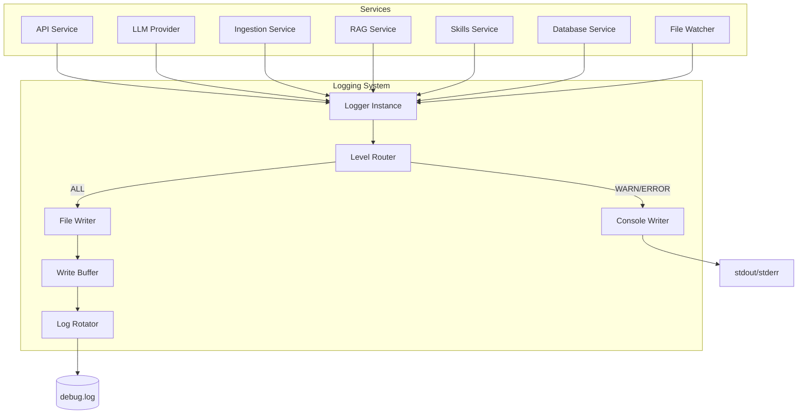

# Design Document: Enhanced Logging System

## Overview

The Enhanced Logging System provides dual-output logging capabilities for Noodexx, enabling clean console output for production use while maintaining comprehensive debug information in a file. The system is designed to be performant, non-blocking, and provide rich contextual information for troubleshooting across all application components.

The core design principle is separation of concerns: console output shows only actionable warnings and errors, while the debug log file captures comprehensive system behavior including DEBUG and INFO level messages. This approach balances production readiness with debugging capability.

Key capabilities:
- Dual-output architecture with level-based routing
- Structured log format with source location tracking (file, line, function)
- Buffered, non-blocking file writes for performance
- Automatic log rotation with configurable size and backup limits
- Shared file access for runtime log viewing
- Structured context fields for event correlation
- Backward compatible with existing configuration

## Architecture

### High-Level Architecture



### Component Architecture

The logging system consists of several key components:

1. **Logger**: The primary interface used by all services. Provides level-based logging methods (Debug, Info, Warn, Error) and supports structured context fields.

2. **MultiWriter**: Routes log messages to appropriate destinations based on level. Implements the dual-output strategy.

3. **FileWriter**: Manages file-based logging with buffering, rotation, and shared access. Handles file creation, error recovery, and graceful degradation.

4. **LogRotator**: Monitors file size and performs rotation when thresholds are exceeded. Manages backup file naming and cleanup.

5. **LogFormatter**: Formats log messages with timestamp, level, component, source location, message, and context fields.

6. **ConfigManager**: Loads and validates logging configuration from config.json and environment variables.

### Data Flow

1. Service calls logger method (e.g., `logger.Debug("processing file", "path", "/data/file.txt")`)
2. Logger captures caller information (file, line, function) using runtime reflection
3. Logger formats message with timestamp, level, component, source location, and context
4. MultiWriter receives formatted message and routes based on level:
   - WARN/ERROR → Console writer (immediate write to stdout/stderr)
   - ALL levels → File writer (buffered write to debug.log)
5. File writer appends to buffer, flushes periodically or on buffer full
6. Log rotator checks file size after each flush, rotates if needed

## Components and Interfaces

### Logger Interface

```go
type Logger struct {
    component string
    level     Level
    writer    io.Writer
    context   map[string]interface{}
}

// Core logging methods
func (l *Logger) Debug(format string, args ...interface{})
func (l *Logger) Info(format string, args ...interface{})
func (l *Logger) Warn(format string, args ...interface{})
func (l *Logger) Error(format string, args ...interface{})

// Structured context methods
func (l *Logger) WithContext(key string, value interface{}) *Logger
func (l *Logger) WithFields(fields map[string]interface{}) *Logger
```

### MultiWriter

```go
type MultiWriter struct {
    consoleWriter io.Writer
    fileWriter    io.Writer
    debugEnabled  bool
}

func NewMultiWriter(consoleWriter, fileWriter io.Writer, debugEnabled bool) *MultiWriter
func (m *MultiWriter) Write(level Level, p []byte) (n int, err error)
```

The MultiWriter routes messages based on level:
- If `debugEnabled` is false, all messages go to console only
- If `debugEnabled` is true:
  - WARN and ERROR go to both console and file
  - DEBUG and INFO go to file only

### FileWriter

```go
type FileWriter struct {
    path       string
    file       *os.File
    buffer     *bufio.Writer
    rotator    *LogRotator
    mu         sync.Mutex
    flushTimer *time.Timer
}

func NewFileWriter(path string, maxSizeMB int, maxBackups int) (*FileWriter, error)
func (f *FileWriter) Write(p []byte) (n int, err error)
func (f *FileWriter) Flush() error
func (f *FileWriter) Close() error
```

Key behaviors:
- Opens file with `os.O_CREATE|os.O_WRONLY|os.O_APPEND` and shared read permissions
- Uses buffered writer with 64KB buffer
- Flushes every 5 seconds or when buffer is full
- Handles write errors gracefully (logs to console, continues operation)
- Checks for rotation after each flush

### LogRotator

```go
type LogRotator struct {
    basePath   string
    maxSizeMB  int
    maxBackups int
}

func NewLogRotator(basePath string, maxSizeMB, maxBackups int) *LogRotator
func (r *LogRotator) ShouldRotate(currentSize int64) bool
func (r *LogRotator) Rotate() error
```

Rotation algorithm:
1. Check if current file size exceeds `maxSizeMB * 1024 * 1024` bytes
2. If yes, close current file
3. Rename existing backups: `debug.log.N` → `debug.log.N+1`
4. Rename current file: `debug.log` → `debug.log.1`
5. Delete oldest backup if count exceeds `maxBackups`
6. Create new empty `debug.log` file

### LogFormatter

```go
type LogFormatter struct {
    includeSource bool
}

type LogEntry struct {
    Timestamp string
    Level     string
    Component string
    File      string
    Line      int
    Function  string
    Message   string
    Context   map[string]interface{}
}

func (f *LogFormatter) Format(entry LogEntry) string
```

Output format:
```
[2024-01-15 14:32:45] INFO [api] handlers.go:123 HandleChat message="processing request" request_id=abc123 user_id=user456
```

Format breakdown:
- `[2024-01-15 14:32:45]` - ISO 8601 timestamp
- `INFO` - Log level
- `[api]` - Component name
- `handlers.go:123` - Source file and line number
- `HandleChat` - Function name (optional, only in debug.log)
- `message="processing request"` - Log message
- `request_id=abc123 user_id=user456` - Structured context fields

### Configuration Extension

```go
type LoggingConfig struct {
    Level        string `json:"level"`          // Console output level
    DebugEnabled bool   `json:"debug_enabled"`  // Enable debug file logging
    File         string `json:"file"`           // Debug log file path
    MaxSizeMB    int    `json:"max_size_mb"`    // Max file size before rotation
    MaxBackups   int    `json:"max_backups"`    // Number of backup files to keep
}
```

Default values:
- `level`: "info"
- `debug_enabled`: true
- `file`: "debug.log"
- `max_size_mb`: 10
- `max_backups`: 3

Environment variable overrides:
- `NOODEXX_LOG_LEVEL` → `level`
- `NOODEXX_DEBUG_ENABLED` → `debug_enabled`
- `NOODEXX_LOG_FILE` → `file`

## Data Models

### Log Entry Structure

```go
type LogEntry struct {
    Timestamp time.Time
    Level     Level
    Component string
    Source    SourceLocation
    Message   string
    Context   map[string]interface{}
}

type SourceLocation struct {
    File     string
    Line     int
    Function string
}
```

### Log Level Enumeration

```go
type Level int

const (
    DEBUG Level = iota  // Detailed diagnostic information
    INFO                // General informational messages
    WARN                // Warning messages for potentially harmful situations
    ERROR               // Error messages for failures
)
```

Level semantics:
- **DEBUG**: Detailed diagnostic information useful for troubleshooting (e.g., "processing chunk 3/10", "cache hit for key X")
- **INFO**: General informational messages about system state (e.g., "server started", "file ingested successfully")
- **WARN**: Potentially harmful situations that don't prevent operation (e.g., "skill load failed", "rate limit approaching")
- **ERROR**: Error events that might still allow the application to continue (e.g., "failed to process file", "database query failed")

### Context Fields

Common context fields used across services:

```go
// Request tracking
"request_id"    string  // Unique identifier for HTTP requests
"session_id"    string  // User session identifier
"user_id"       string  // User identifier (if applicable)

// File operations
"file_path"     string  // Path to file being processed
"file_size"     int64   // File size in bytes
"chunk_index"   int     // Current chunk number
"total_chunks"  int     // Total number of chunks

// LLM operations
"provider"      string  // LLM provider name (ollama, openai, anthropic)
"model"         string  // Model name
"tokens"        int     // Token count
"latency_ms"    int64   // Request latency in milliseconds

// RAG operations
"query"         string  // Search query
"result_count"  int     // Number of results returned
"min_score"     float64 // Minimum relevance score

// Skills operations
"skill_name"    string  // Name of skill being executed
"skill_path"    string  // Path to skill file
"exit_code"     int     // Skill execution exit code

// Database operations
"operation"     string  // Database operation (insert, update, delete, select)
"table"         string  // Table name
"rows_affected" int     // Number of rows affected

// Error context
"error"         string  // Error message
"stack_trace"   string  // Stack trace (for ERROR level)
```


## Correctness Properties

A property is a characteristic or behavior that should hold true across all valid executions of a system—essentially, a formal statement about what the system should do. Properties serve as the bridge between human-readable specifications and machine-verifiable correctness guarantees.

### Property 1: Level-based message routing

For any log message at WARN or ERROR level, the MultiWriter should route it to both console output and debug log file (when debug is enabled), and for any message at DEBUG or INFO level, the MultiWriter should route it only to the debug log file.

**Validates: Requirements 1.1, 1.2, 1.4**

### Property 2: Configuration round-trip for debug_enabled

For any valid boolean value of debug_enabled in the configuration, loading the configuration and reading the debug_enabled field should return the same boolean value.

**Validates: Requirements 2.1**

### Property 3: Custom log file path usage

For any valid file path specified in logging.file configuration, the logger should create and write to a file at that exact path.

**Validates: Requirements 3.2**

### Property 4: File creation with graceful degradation

For any log file path, if the file does not exist, the logger should create it; if creation fails, the logger should log an error to console and continue with console-only logging without crashing.

**Validates: Requirements 3.4, 3.5**

### Property 5: Service debug output completeness

For any service operation (API request, LLM call, file ingestion, RAG search, skill execution, database query, file watch event), the debug log should contain all required context fields specific to that operation type.

**Validates: Requirements 4.1, 4.2, 4.3, 4.4, 4.5, 4.6, 4.7**

### Property 6: Error logging with context

For any error that occurs in any service, the error log entry should include the operation name, relevant input parameters, and error message at ERROR level.

**Validates: Requirements 4.8**

### Property 7: Log rotation on size threshold

For any sequence of log writes, when the debug log file size exceeds max_size_mb megabytes, the logger should rotate the file by renaming it to debug.log.1 and creating a new empty debug.log.

**Validates: Requirements 5.1, 5.2, 5.5**

### Property 8: Backup file incremental naming

For any existing backup files, when rotation occurs, each backup file debug.log.N should be renamed to debug.log.N+1 before the current file is renamed to debug.log.1.

**Validates: Requirements 5.3**

### Property 9: Backup file cleanup

For any rotation operation, when the number of backup files would exceed max_backups, the oldest backup file should be deleted.

**Validates: Requirements 5.4**

### Property 10: Log message format completeness

For any log message, the formatted output should contain a timestamp in ISO 8601 format (YYYY-MM-DD HH:MM:SS), the log level, the component name in square brackets, and the message text.

**Validates: Requirements 7.1, 7.2, 7.3**

### Property 11: Multi-line message preservation

For any log message containing newline characters, the formatted output should preserve all line breaks without corruption.

**Validates: Requirements 7.4**

### Property 12: Control character sanitization

For any log message containing control characters (excluding newlines and tabs), the formatted output should escape or remove those characters to prevent log corruption.

**Validates: Requirements 7.5**

### Property 13: Context field formatting

For any log message with context fields, the formatted output should append all context fields as key=value pairs separated by spaces.

**Validates: Requirements 8.1, 8.2, 8.4**

### Property 14: Configuration validation for log level

For any logging.level value in configuration, if the value is not one of "debug", "info", "warn", or "error", the config manager should return a validation error.

**Validates: Requirements 10.5**

## Error Handling

### File System Errors

**File Creation Failure**:
- Scenario: Debug log file cannot be created (permissions, disk full, invalid path)
- Handling: Log error to console with details, disable file logging, continue with console-only mode
- Recovery: None (requires manual intervention)

**File Write Failure**:
- Scenario: Write to debug log file fails (disk full, file deleted externally)
- Handling: Log error to console, attempt to reopen file on next write
- Recovery: Automatic retry on next log write

**File Rotation Failure**:
- Scenario: Cannot rename or delete files during rotation
- Handling: Log error to console, continue writing to current file (may exceed size limit)
- Recovery: Retry rotation on next size check

### Configuration Errors

**Invalid Log Level**:
- Scenario: logging.level contains invalid value
- Handling: Return validation error during config load, prevent application startup
- Recovery: User must fix configuration

**Invalid File Path**:
- Scenario: logging.file contains invalid characters or inaccessible path
- Handling: Log error to console, fall back to default "debug.log" path
- Recovery: Automatic fallback to default

**Missing Configuration Fields**:
- Scenario: debug_enabled, max_size_mb, or max_backups not specified
- Handling: Use default values (true, 10, 3 respectively)
- Recovery: Automatic with defaults

### Runtime Errors

**Buffer Flush Failure**:
- Scenario: Buffered writes cannot be flushed to disk
- Handling: Log error to console, discard buffer contents, continue operation
- Recovery: Next write attempt will retry

**Concurrent Access Conflicts**:
- Scenario: File locked by another process (Windows)
- Handling: Retry write with exponential backoff (3 attempts), then log error and skip write
- Recovery: Automatic retry on next log write

**Shutdown Timeout**:
- Scenario: Buffer flush takes too long during shutdown
- Handling: Force close after 5-second timeout, may lose buffered messages
- Recovery: None (application is shutting down)

### Error Logging Strategy

All error handling follows these principles:
1. **Never crash**: Logging failures should never terminate the application
2. **Degrade gracefully**: Fall back to console-only logging if file logging fails
3. **Inform the user**: Always log errors to console so they're visible
4. **Provide context**: Include operation details and error messages in error logs
5. **Retry when reasonable**: Attempt recovery for transient errors (file locks, temporary disk issues)

## Testing Strategy

### Dual Testing Approach

The Enhanced Logging System will be validated using both unit tests and property-based tests. These approaches are complementary:

- **Unit tests** verify specific examples, edge cases, and error conditions
- **Property tests** verify universal properties across all inputs

Together, they provide comprehensive coverage: unit tests catch concrete bugs in specific scenarios, while property tests verify general correctness across a wide range of inputs.

### Unit Testing

Unit tests will focus on:

**Specific Examples**:
- Debug logging disabled (debug_enabled=false) routes all messages to console only
- Default file path is "debug.log" when logging.file is empty
- Default values (debug_enabled=true, max_size_mb=10, max_backups=3) are applied when not specified
- Environment variable NOODEXX_DEBUG_ENABLED overrides config file
- Rotation creates debug.log.1 from debug.log
- New empty debug.log is created after rotation
- Shared read access allows concurrent file readers
- Concurrent readers don't cause write errors
- Buffer flushes every 5 seconds
- Shutdown flushes all buffered messages
- File write failure triggers console error and continues operation
- Old config without debug_enabled defaults to true
- Existing logging.level field still works for console filtering
- Existing logging.file field is used as debug log path
- Console output format remains unchanged

**Edge Cases**:
- Empty log messages
- Very long log messages (>10KB)
- Log messages with only whitespace
- File paths with special characters
- Maximum integer values for max_size_mb and max_backups
- Zero or negative values for max_size_mb and max_backups
- Rotation when no backup files exist
- Rotation when max_backups is 0
- Rotation when disk is nearly full

**Error Conditions**:
- Invalid log level in configuration
- File creation fails (permissions)
- File write fails (disk full)
- File rotation fails (cannot rename)
- Buffer flush fails
- Concurrent access conflicts (Windows file locking)
- Shutdown timeout during flush

**Integration Tests**:
- All services (API, LLM, Ingestion, RAG, Skills, Database, Watcher) produce debug output
- Log messages from multiple services are correctly interleaved
- Context fields from different services are properly formatted
- End-to-end: log message from service call to file write

### Property-Based Testing

Property-based tests will use the **testing/quick** package (Go's built-in property testing) or **gopter** for more advanced scenarios. Each test will run a minimum of 100 iterations to ensure comprehensive input coverage.

**Property Test Configuration**:
- Minimum iterations: 100 per test
- Each test tagged with: `// Feature: noodexx-phase-3-enhanced-logging, Property N: [property text]`
- Random input generation for: log levels, messages, context fields, file paths, configuration values

**Properties to Test**:

1. **Level-based routing** (Property 1)
   - Generate: random log messages at all levels
   - Verify: WARN/ERROR go to console, all levels go to file (when enabled)
   - Tag: `// Feature: noodexx-phase-3-enhanced-logging, Property 1: Level-based message routing`

2. **Configuration round-trip** (Property 2)
   - Generate: random boolean values for debug_enabled
   - Verify: loaded value equals original value
   - Tag: `// Feature: noodexx-phase-3-enhanced-logging, Property 2: Configuration round-trip for debug_enabled`

3. **Custom file path** (Property 3)
   - Generate: random valid file paths
   - Verify: logger writes to specified path
   - Tag: `// Feature: noodexx-phase-3-enhanced-logging, Property 3: Custom log file path usage`

4. **File creation with graceful degradation** (Property 4)
   - Generate: random file paths (some invalid)
   - Verify: file created if possible, console-only if not, no crash
   - Tag: `// Feature: noodexx-phase-3-enhanced-logging, Property 4: File creation with graceful degradation`

5. **Service debug output** (Property 5)
   - Generate: random service operations with context
   - Verify: all required context fields present in log
   - Tag: `// Feature: noodexx-phase-3-enhanced-logging, Property 5: Service debug output completeness`

6. **Error logging context** (Property 6)
   - Generate: random errors from services
   - Verify: error log contains operation, parameters, error message
   - Tag: `// Feature: noodexx-phase-3-enhanced-logging, Property 6: Error logging with context`

7. **Log rotation on threshold** (Property 7)
   - Generate: random log writes until size threshold
   - Verify: rotation occurs, file renamed, new file created
   - Tag: `// Feature: noodexx-phase-3-enhanced-logging, Property 7: Log rotation on size threshold`

8. **Backup file naming** (Property 8)
   - Generate: random number of existing backups
   - Verify: each backup incremented correctly during rotation
   - Tag: `// Feature: noodexx-phase-3-enhanced-logging, Property 8: Backup file incremental naming`

9. **Backup cleanup** (Property 9)
   - Generate: random rotations beyond max_backups
   - Verify: oldest backup deleted when limit exceeded
   - Tag: `// Feature: noodexx-phase-3-enhanced-logging, Property 9: Backup file cleanup`

10. **Log format completeness** (Property 10)
    - Generate: random log messages at all levels
    - Verify: output contains timestamp, level, component, message
    - Tag: `// Feature: noodexx-phase-3-enhanced-logging, Property 10: Log message format completeness`

11. **Multi-line preservation** (Property 11)
    - Generate: random messages with newlines
    - Verify: all newlines preserved in output
    - Tag: `// Feature: noodexx-phase-3-enhanced-logging, Property 11: Multi-line message preservation`

12. **Control character sanitization** (Property 12)
    - Generate: random messages with control characters
    - Verify: control characters escaped/removed (except \n, \t)
    - Tag: `// Feature: noodexx-phase-3-enhanced-logging, Property 12: Control character sanitization`

13. **Context field formatting** (Property 13)
    - Generate: random context fields (key-value pairs)
    - Verify: output contains all fields as key=value separated by spaces
    - Tag: `// Feature: noodexx-phase-3-enhanced-logging, Property 13: Context field formatting`

14. **Config validation** (Property 14)
    - Generate: random log level strings (valid and invalid)
    - Verify: invalid values rejected, valid values accepted
    - Tag: `// Feature: noodexx-phase-3-enhanced-logging, Property 14: Configuration validation for log level`

### Test Organization

```
noodexx/internal/logging/
├── logger.go
├── logger_test.go           # Unit tests for Logger
├── logger_property_test.go  # Property tests for Logger
├── multiwriter.go
├── multiwriter_test.go      # Unit tests for MultiWriter
├── filewriter.go
├── filewriter_test.go       # Unit tests for FileWriter
├── rotator.go
├── rotator_test.go          # Unit tests and property tests for LogRotator
├── formatter.go
└── formatter_test.go        # Unit tests and property tests for LogFormatter
```

### Performance Testing

While not part of the correctness testing strategy, performance characteristics should be validated:

- **Throughput**: Measure log writes per second with buffering
- **Latency**: Measure time from log call to buffer write (should be <1ms)
- **Memory**: Measure buffer memory usage under load
- **File I/O**: Measure disk write frequency and batch sizes

Performance tests will be run separately and are not required for correctness validation.

### Test Coverage Goals

- **Line coverage**: >90% for all logging package code
- **Branch coverage**: >85% for error handling paths
- **Property coverage**: 100% of correctness properties implemented as tests
- **Integration coverage**: All 7 services produce debug output in integration tests


## Implementation Details

### Logger Initialization

The logger initialization process changes to support dual-output:

```go
// In main.go
func initializeLogging(cfg *config.Config) (*logging.Logger, error) {
    var writer io.Writer
    
    if cfg.Logging.DebugEnabled {
        // Create file writer with rotation
        fileWriter, err := logging.NewFileWriter(
            cfg.Logging.File,
            cfg.Logging.MaxSizeMB,
            cfg.Logging.MaxBackups,
        )
        if err != nil {
            // Fall back to console only
            log.Printf("Failed to create debug log file: %v", err)
            writer = os.Stdout
        } else {
            // Create multi-writer for dual output
            consoleWriter := os.Stdout
            writer = logging.NewMultiWriter(consoleWriter, fileWriter, true)
        }
    } else {
        writer = os.Stdout
    }
    
    level := logging.ParseLevel(cfg.Logging.Level)
    return logging.NewLogger("main", level, writer), nil
}
```

### Source Location Capture

The logger captures source location using Go's runtime package:

```go
func (l *Logger) log(level Level, format string, args ...interface{}) {
    if level < l.level {
        return
    }
    
    // Capture caller information
    _, file, line, ok := runtime.Caller(2) // Skip 2 frames: log() and Debug/Info/Warn/Error
    if ok {
        // Extract just the filename, not full path
        file = filepath.Base(file)
    } else {
        file = "unknown"
        line = 0
    }
    
    // Get function name
    pc, _, _, ok := runtime.Caller(2)
    funcName := "unknown"
    if ok {
        fn := runtime.FuncForPC(pc)
        if fn != nil {
            funcName = filepath.Base(fn.Name())
        }
    }
    
    entry := LogEntry{
        Timestamp: time.Now(),
        Level:     level,
        Component: l.component,
        Source: SourceLocation{
            File:     file,
            Line:     line,
            Function: funcName,
        },
        Message: fmt.Sprintf(format, args...),
        Context: l.context,
    }
    
    formatted := l.formatter.Format(entry)
    l.writer.Write([]byte(formatted))
}
```

### Structured Context API

Services can add context fields using a fluent API:

```go
// Example: API handler logging
func (h *Handler) HandleChat(w http.ResponseWriter, r *http.Request) {
    requestID := generateRequestID()
    
    // Create logger with context
    logger := h.logger.WithContext("request_id", requestID).
                       WithContext("method", r.Method).
                       WithContext("path", r.URL.Path)
    
    logger.Debug("processing chat request")
    
    // ... handle request ...
    
    logger.Info("chat request completed", "status", 200, "latency_ms", 45)
}

// Example: LLM provider logging
func (p *OpenAIProvider) Chat(ctx context.Context, messages []Message) (*Response, error) {
    logger := p.logger.WithFields(map[string]interface{}{
        "provider": "openai",
        "model":    p.model,
        "messages": len(messages),
    })
    
    logger.Debug("sending chat request to OpenAI")
    
    start := time.Now()
    resp, err := p.client.CreateChatCompletion(ctx, req)
    latency := time.Since(start).Milliseconds()
    
    if err != nil {
        logger.Error("OpenAI request failed", "error", err.Error(), "latency_ms", latency)
        return nil, err
    }
    
    logger.Debug("OpenAI request completed", 
        "tokens", resp.Usage.TotalTokens,
        "latency_ms", latency)
    
    return resp, nil
}
```

### File Writer Implementation Details

**Buffering Strategy**:
- Use `bufio.Writer` with 64KB buffer
- Flush on buffer full (automatic)
- Flush every 5 seconds (timer-based)
- Flush on application shutdown (explicit)

**Shared Access**:
- Open file with `os.O_CREATE|os.O_WRONLY|os.O_APPEND`
- On Unix: No special flags needed (shared by default)
- On Windows: Use `syscall.FILE_SHARE_READ` to allow concurrent readers

**Thread Safety**:
- Use `sync.Mutex` to protect file operations
- Lock during: write, flush, rotation
- Keep critical sections small to minimize blocking

### Log Rotation Implementation

**Size Checking**:
- Check file size after each flush operation
- Use `os.Stat()` to get current file size
- Compare against `maxSizeMB * 1024 * 1024` bytes

**Rotation Process**:
```go
func (r *LogRotator) Rotate() error {
    // 1. Close current file
    if err := r.file.Close(); err != nil {
        return fmt.Errorf("failed to close current log: %w", err)
    }
    
    // 2. Rename existing backups (in reverse order)
    for i := r.maxBackups - 1; i >= 1; i-- {
        oldPath := fmt.Sprintf("%s.%d", r.basePath, i)
        newPath := fmt.Sprintf("%s.%d", r.basePath, i+1)
        
        if _, err := os.Stat(oldPath); err == nil {
            if i == r.maxBackups-1 {
                // Delete oldest backup
                os.Remove(oldPath)
            } else {
                // Rename to increment
                os.Rename(oldPath, newPath)
            }
        }
    }
    
    // 3. Rename current log to .1
    if err := os.Rename(r.basePath, r.basePath+".1"); err != nil {
        return fmt.Errorf("failed to rename current log: %w", err)
    }
    
    // 4. Create new log file
    file, err := os.OpenFile(r.basePath, 
        os.O_CREATE|os.O_WRONLY|os.O_APPEND, 0644)
    if err != nil {
        return fmt.Errorf("failed to create new log: %w", err)
    }
    
    r.file = file
    return nil
}
```

### Configuration Schema Extension

The `config.json` schema is extended with new logging fields:

```json
{
  "provider": { ... },
  "privacy": { ... },
  "folders": [ ... ],
  "logging": {
    "level": "info",
    "debug_enabled": true,
    "file": "debug.log",
    "max_size_mb": 10,
    "max_backups": 3
  },
  "guardrails": { ... },
  "server": { ... }
}
```

**Field Descriptions**:
- `level`: Console output level (debug, info, warn, error) - existing field
- `debug_enabled`: Enable debug file logging (boolean) - new field
- `file`: Debug log file path (string) - existing field, repurposed
- `max_size_mb`: Max file size before rotation (integer) - new field
- `max_backups`: Number of backup files to keep (integer) - new field

**Backward Compatibility**:
- If `debug_enabled` is missing, default to `true`
- If `file` is missing or empty, default to `"debug.log"`
- If `max_size_mb` is missing, default to `10`
- If `max_backups` is missing, default to `3`
- Existing `level` field continues to work as before

### Service Integration Examples

Each service will be updated to use the enhanced logger:

**API Service** (`internal/api/handlers.go`):
```go
func (s *Server) HandleChat(w http.ResponseWriter, r *http.Request) {
    requestID := r.Header.Get("X-Request-ID")
    if requestID == "" {
        requestID = generateRequestID()
    }
    
    logger := s.logger.WithContext("request_id", requestID)
    logger.Debug("received chat request", "method", r.Method, "path", r.URL.Path)
    
    // ... process request ...
    
    logger.Debug("chat request completed", "status", status, "latency_ms", latency)
}
```

**Ingestion Service** (`internal/ingest/ingester.go`):
```go
func (i *Ingester) IngestFile(ctx context.Context, path string) error {
    logger := i.logger.WithContext("file_path", path)
    logger.Debug("starting file ingestion")
    
    fileInfo, err := os.Stat(path)
    if err != nil {
        logger.Error("failed to stat file", "error", err.Error())
        return err
    }
    
    logger.Debug("file info retrieved", "size", fileInfo.Size())
    
    // ... process file ...
    
    logger.Debug("file ingestion completed", "chunks", chunkCount)
    return nil
}
```

**RAG Service** (`internal/rag/searcher.go`):
```go
func (s *Searcher) Search(ctx context.Context, query string, limit int) ([]Result, error) {
    logger := s.logger.WithContext("query", query).WithContext("limit", limit)
    logger.Debug("executing RAG search")
    
    results, err := s.store.SearchEmbeddings(ctx, queryEmbedding, limit)
    if err != nil {
        logger.Error("search failed", "error", err.Error())
        return nil, err
    }
    
    logger.Debug("search completed", 
        "result_count", len(results),
        "min_score", minScore(results))
    
    return results, nil
}
```

### Performance Considerations

**Write Amplification**:
- Buffering reduces syscalls from N (per log) to ~1 per 5 seconds
- 64KB buffer holds ~400-800 log lines (depending on message size)
- Reduces disk I/O by 400-800x compared to unbuffered writes

**Memory Usage**:
- Each logger instance: ~200 bytes (struct + context map)
- File writer buffer: 64KB
- Total overhead: ~65KB per application instance
- Negligible compared to typical application memory usage

**CPU Overhead**:
- Source location capture: ~1-2 microseconds per log call
- Message formatting: ~5-10 microseconds per log call
- Buffer write: <1 microsecond (memory operation)
- Total: ~10-15 microseconds per log call
- Negligible for typical application workloads

**Disk I/O**:
- Flush frequency: Every 5 seconds or on buffer full
- Typical flush size: 64KB (one buffer)
- Disk writes: ~12 per minute (at 5-second intervals)
- Rotation overhead: ~100ms per rotation (file renames)

**Blocking Behavior**:
- Log calls block only during buffer write (memory operation, <1μs)
- Flush operations block briefly during disk write (~1-10ms)
- Rotation blocks during file operations (~100ms)
- Services are not blocked during normal logging

### Migration Path

**Phase 1: Add New Components** (no breaking changes)
- Implement MultiWriter, FileWriter, LogRotator, LogFormatter
- Add new configuration fields with defaults
- Keep existing Logger interface unchanged

**Phase 2: Update Logger** (internal changes only)
- Add source location capture to Logger.log()
- Add context field support (WithContext, WithFields)
- Update Logger to use MultiWriter

**Phase 3: Update Services** (gradual rollout)
- Update each service to add context fields to log calls
- No changes to log call signatures (backward compatible)
- Services can be updated incrementally

**Phase 4: Documentation and Testing**
- Update README with new logging features
- Add examples of context field usage
- Run full test suite including property tests

### Monitoring and Observability

**Log File Monitoring**:
- Users can monitor `debug.log` with: `tail -f debug.log`
- Log rotation is transparent to monitoring tools
- File size can be monitored with: `ls -lh debug.log`

**Health Indicators**:
- Console errors indicate file logging failures
- Absence of debug.log indicates debug logging is disabled
- Backup files (debug.log.1, etc.) indicate rotation is working

**Troubleshooting**:
- Check console output for file creation/write errors
- Verify file permissions on debug.log
- Check disk space if rotation fails
- Review configuration for correct paths and settings

### Security Considerations

**Log Injection**:
- Control characters are sanitized to prevent log injection attacks
- Newlines and tabs are preserved for readability
- Other control characters (0x00-0x1F except \n, \t) are escaped

**Sensitive Data**:
- Privacy mode is respected (no change from existing behavior)
- Context fields may contain sensitive data (file paths, user IDs)
- Users should secure debug.log with appropriate file permissions (0600)

**File Permissions**:
- Debug log created with 0644 permissions (owner read/write, group/other read)
- Users can restrict with: `chmod 600 debug.log`
- Rotation preserves file permissions

**Disk Space**:
- Log rotation prevents unbounded disk usage
- Default limits: 10MB * 4 files = 40MB maximum
- Users can adjust limits based on disk capacity

