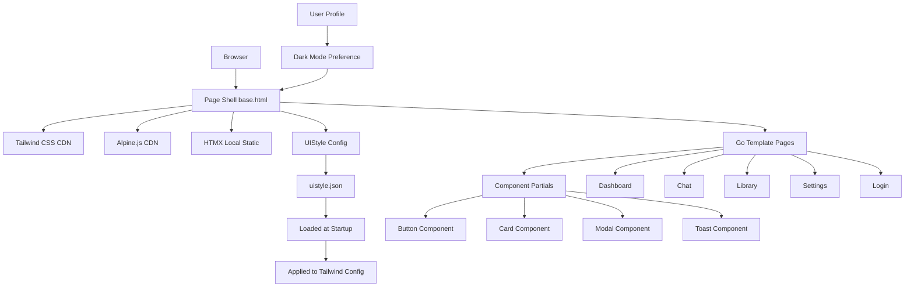
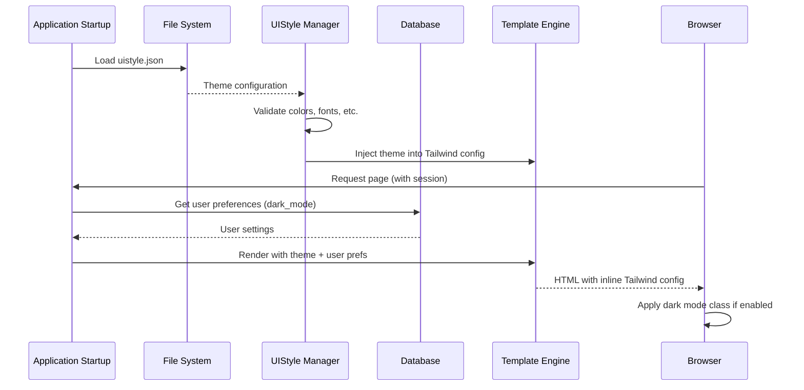
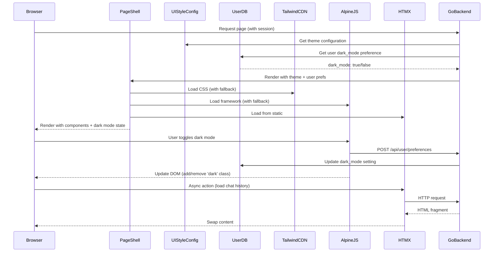

# Design Document: Noodexx Phase 5 UI Enhancements

## Overview

This design modernizes the Noodexx user interface by integrating Tailwind CSS, Alpine.js, and the existing HTMX framework without introducing a build pipeline. The approach maintains the Go template architecture from Phase 2 while replacing hand-rolled CSS and vanilla JavaScript with a consistent, maintainable design system.

**Key Design Principles**:
- Modern, clean UI with buttons and interactive elements where appropriate
- Centralized theme configuration via `uistyle.json` (loaded at startup, applies to all users)
- Per-user preferences (dark mode) stored in user profiles (multi-user aware)
- No backend logic changes, purely presentational enhancements

## Architecture



## Theme Configuration Architecture



## Main Workflow: Page Load and Interaction




## Components and Interfaces

### Component 0: UIStyle Configuration Manager

**Purpose**: Loads and manages the centralized theme configuration from `uistyle.json`, making it available to all templates and users.

**File Location**: `noodexx/uistyle.json`

**Interface**:
```go
// UIStyle configuration structure
type UIStyleConfig struct {
    Colors      ColorScheme      `json:"colors"`
    Typography  TypographyConfig `json:"typography"`
    Spacing     SpacingConfig    `json:"spacing"`
    BorderRadius RadiusConfig    `json:"border_radius"`
    Shadows     ShadowConfig     `json:"shadows"`
}

type ColorScheme struct {
    Primary   ColorPalette `json:"primary"`
    Secondary ColorPalette `json:"secondary"`
    Success   ColorPalette `json:"success"`
    Warning   ColorPalette `json:"warning"`
    Error     ColorPalette `json:"error"`
    Info      ColorPalette `json:"info"`
    Surface   ColorPalette `json:"surface"`
}

type ColorPalette struct {
    Shade50  string `json:"50"`
    Shade100 string `json:"100"`
    Shade200 string `json:"200"`
    Shade300 string `json:"300"`
    Shade400 string `json:"400"`
    Shade500 string `json:"500"`
    Shade600 string `json:"600"`
    Shade700 string `json:"700"`
    Shade800 string `json:"800"`
    Shade900 string `json:"900"`
}

type TypographyConfig struct {
    FontFamily FontFamilies `json:"font_family"`
    FontSizes  FontSizes    `json:"font_sizes"`
}

type FontFamilies struct {
    Sans  []string `json:"sans"`
    Mono  []string `json:"mono"`
}

type FontSizes struct {
    XS   string `json:"xs"`
    SM   string `json:"sm"`
    Base string `json:"base"`
    LG   string `json:"lg"`
    XL   string `json:"xl"`
    XL2  string `json:"2xl"`
    XL3  string `json:"3xl"`
}

type SpacingConfig struct {
    Unit string            `json:"unit"` // "px" or "rem"
    Scale map[string]string `json:"scale"` // "1": "0.25rem", "2": "0.5rem", etc.
}

type RadiusConfig struct {
    None string `json:"none"`
    SM   string `json:"sm"`
    Base string `json:"base"`
    MD   string `json:"md"`
    LG   string `json:"lg"`
    XL   string `json:"xl"`
    Full string `json:"full"`
}

type ShadowConfig struct {
    SM   string `json:"sm"`
    Base string `json:"base"`
    MD   string `json:"md"`
    LG   string `json:"lg"`
    XL   string `json:"xl"`
}
```

**Example uistyle.json**:
```json
{
  "colors": {
    "primary": {
      "50": "#eff6ff",
      "100": "#dbeafe",
      "200": "#bfdbfe",
      "300": "#93c5fd",
      "400": "#60a5fa",
      "500": "#3b82f6",
      "600": "#2563eb",
      "700": "#1d4ed8",
      "800": "#1e40af",
      "900": "#1e3a8a"
    },
    "surface": {
      "50": "#fafafa",
      "100": "#f5f5f5",
      "200": "#e5e5e5",
      "300": "#d4d4d4",
      "400": "#a3a3a3",
      "500": "#737373",
      "600": "#525252",
      "700": "#404040",
      "800": "#262626",
      "900": "#171717"
    }
  },
  "typography": {
    "font_family": {
      "sans": ["Inter", "system-ui", "sans-serif"],
      "mono": ["JetBrains Mono", "monospace"]
    },
    "font_sizes": {
      "xs": "0.75rem",
      "sm": "0.875rem",
      "base": "1rem",
      "lg": "1.125rem",
      "xl": "1.25rem",
      "2xl": "1.5rem",
      "3xl": "1.875rem"
    }
  },
  "border_radius": {
    "none": "0",
    "sm": "0.125rem",
    "base": "0.25rem",
    "md": "0.375rem",
    "lg": "0.5rem",
    "xl": "0.75rem",
    "full": "9999px"
  },
  "shadows": {
    "sm": "0 1px 2px 0 rgb(0 0 0 / 0.05)",
    "base": "0 1px 3px 0 rgb(0 0 0 / 0.1)",
    "md": "0 4px 6px -1px rgb(0 0 0 / 0.1)",
    "lg": "0 10px 15px -3px rgb(0 0 0 / 0.1)",
    "xl": "0 20px 25px -5px rgb(0 0 0 / 0.1)"
  }
}
```

**Responsibilities**:
- Load uistyle.json at application startup
- Validate all color values are valid hex codes
- Validate all palettes have required shades (50-900)
- Convert configuration to Tailwind config format
- Inject into template rendering context
- Provide hot-reload capability (optional, for development)

**Loading Strategy**:
```go
// In main.go or initialization
func loadUIStyle() (*UIStyleConfig, error) {
    data, err := os.ReadFile("uistyle.json")
    if err != nil {
        return nil, fmt.Errorf("failed to load uistyle.json: %w", err)
    }
    
    var config UIStyleConfig
    if err := json.Unmarshal(data, &config); err != nil {
        return nil, fmt.Errorf("failed to parse uistyle.json: %w", err)
    }
    
    if err := validateUIStyle(&config); err != nil {
        return nil, fmt.Errorf("invalid uistyle.json: %w", err)
    }
    
    return &config, nil
}

// Make available to all handlers
type Server struct {
    // ... existing fields
    UIStyle *UIStyleConfig
}
```

### Component 1: Page Shell (base.html)

**Purpose**: Provides the foundational layout structure with dependency loading, theme management, and consistent navigation.

**Interface**:
```go
// Template data structure
type PageData struct {
    Title       string
    Username    string
    CurrentPage string
    Content     template.HTML
    UIStyle     *UIStyleConfig  // NEW: Theme configuration
    DarkMode    bool            // NEW: User's dark mode preference from DB
}
```

**Responsibilities**:
- Load Tailwind CSS, Alpine.js, and HTMX with CDN fallback
- Inject UIStyle configuration into Tailwind config
- Render fixed sidebar and topbar
- Initialize dark mode state from user profile (not localStorage)
- Provide global toast notification container

**Key Template Blocks**:
```html
<!DOCTYPE html>
<html x-data="{ darkMode: {{.DarkMode}} }" :class="{ 'dark': darkMode }">
<head>
    <script src="https://cdn.tailwindcss.com"></script>
    <script>
        tailwind.config = {
            darkMode: 'class',
            theme: {
                extend: {
                    colors: {
                        primary: {{.UIStyle.Colors.Primary | toJSON}},
                        secondary: {{.UIStyle.Colors.Secondary | toJSON}},
                        success: {{.UIStyle.Colors.Success | toJSON}},
                        warning: {{.UIStyle.Colors.Warning | toJSON}},
                        error: {{.UIStyle.Colors.Error | toJSON}},
                        info: {{.UIStyle.Colors.Info | toJSON}},
                        surface: {{.UIStyle.Colors.Surface | toJSON}}
                    },
                    fontFamily: {{.UIStyle.Typography.FontFamily | toJSON}},
                    fontSize: {{.UIStyle.Typography.FontSizes | toJSON}},
                    borderRadius: {{.UIStyle.BorderRadius | toJSON}},
                    boxShadow: {{.UIStyle.Shadows | toJSON}}
                }
            }
        }
    </script>
    <script defer src="https://cdn.jsdelivr.net/npm/alpinejs@3.x.x/dist/cdn.min.js"></script>
    <script src="/static/htmx.min.js"></script>
</head>
<body>
    <!-- Sidebar, Topbar, Main Content -->
</body>
</html>
```

**Dark Mode Toggle Handler**:
```html
<button 
    @click="toggleDarkMode()"
    class="p-2 rounded-lg hover:bg-surface-100 dark:hover:bg-surface-700 transition-colors"
    aria-label="Toggle dark mode"
>
    <svg x-show="!darkMode" class="w-5 h-5"><!-- moon icon --></svg>
    <svg x-show="darkMode" class="w-5 h-5"><!-- sun icon --></svg>
</button>

<script>
function toggleDarkMode() {
    // Toggle local state immediately for responsiveness
    this.darkMode = !this.darkMode;
    
    // Persist to backend (user profile)
    fetch('/api/user/preferences', {
        method: 'POST',
        headers: { 'Content-Type': 'application/json' },
        body: JSON.stringify({ dark_mode: this.darkMode })
    }).catch(err => {
        console.error('Failed to save dark mode preference:', err);
        // Revert on error
        this.darkMode = !this.darkMode;
    });
}
</script>
```

### Component 2: Button Component

**Purpose**: Reusable button with consistent styling, variants, sizes, and loading states.

**Interface**:
```go
type ButtonProps struct {
    Variant string // "primary", "secondary", "danger", "ghost"
    Size    string // "sm", "md", "lg"
    Loading bool
    Disabled bool
    Type    string // "button", "submit"
    Class   string // Additional classes
}
```

**Template** (web/templates/components/button.html):
```html
{{define "button"}}
<button 
    type="{{.Type | default "button"}}"
    class="btn btn-{{.Variant}} btn-{{.Size}} {{.Class}}"
    {{if or .Loading .Disabled}}disabled{{end}}
>
    {{if .Loading}}
        <svg class="animate-spin h-4 w-4 mr-2" viewBox="0 0 24 24"><!-- spinner --></svg>
    {{end}}
    {{.Content}}
</button>
{{end}}
```

### Component 3: Card Component

**Purpose**: Container for content sections with consistent border, shadow, and dark mode support.

**Interface**:
```go
type CardProps struct {
    Title   string
    Class   string
    Content template.HTML
}
```

**Template** (web/templates/components/card.html):
```html
{{define "card"}}
<div class="bg-white dark:bg-surface-800 rounded-lg shadow-md border border-surface-200 dark:border-surface-700 p-6 {{.Class}}">
    {{if .Title}}
        <h3 class="text-lg font-semibold mb-4">{{.Title}}</h3>
    {{end}}
    {{.Content}}
</div>
{{end}}
```

### Component 4: Modal Component

**Purpose**: Dialog overlay for confirmations, forms, and detail views with focus trapping.

**Interface**:
```go
type ModalProps struct {
    ID      string
    Title   string
    Content template.HTML
    Actions template.HTML
}
```

**Template** (web/templates/components/modal.html):
```html
{{define "modal"}}
<div x-data="{ open: false }" @open-modal-{{.ID}}.window="open = true">
    <div x-show="open" 
         x-transition:enter="transition ease-out duration-200"
         x-transition:leave="transition ease-in duration-150"
         class="fixed inset-0 z-50 overflow-y-auto"
         aria-modal="true"
         role="dialog">
        <!-- Backdrop -->
        <div class="fixed inset-0 bg-black bg-opacity-50" @click="open = false"></div>
        
        <!-- Modal content -->
        <div class="relative min-h-screen flex items-center justify-center p-4">
            <div class="relative bg-white dark:bg-surface-800 rounded-lg shadow-xl max-w-md w-full p-6">
                <h2 class="text-xl font-semibold mb-4">{{.Title}}</h2>
                {{.Content}}
                <div class="mt-6 flex justify-end gap-3">
                    {{.Actions}}
                </div>
            </div>
        </div>
    </div>
</div>
{{end}}
```

### Component 5: Toast Notification System

**Purpose**: Non-intrusive notifications with auto-dismiss and stacking behavior.

**Interface**:
```go
type ToastProps struct {
    Variant string // "success", "error", "info", "warning"
    Message string
    Duration int // milliseconds
}
```

**Template** (web/templates/components/toast.html):
```html
{{define "toast-container"}}
<div x-data="toastManager()" 
     @toast.window="addToast($event.detail)"
     class="fixed top-4 right-4 z-50 space-y-3">
    <template x-for="toast in toasts" :key="toast.id">
        <div x-show="toast.visible"
             x-transition:enter="transition ease-out duration-200 transform"
             x-transition:enter-start="translate-x-full opacity-0"
             x-transition:leave="transition ease-in duration-150"
             class="bg-white dark:bg-surface-800 rounded-lg shadow-lg border-l-4 p-4 max-w-sm"
             :class="{
                 'border-green-500': toast.variant === 'success',
                 'border-red-500': toast.variant === 'error',
                 'border-blue-500': toast.variant === 'info',
                 'border-yellow-500': toast.variant === 'warning'
             }">
            <div class="flex items-start">
                <span x-text="toast.message" class="flex-1"></span>
                <button @click="removeToast(toast.id)" class="ml-4 text-surface-400 hover:text-surface-600">
                    ×
                </button>
            </div>
        </div>
    </template>
</div>

<script>
function toastManager() {
    return {
        toasts: [],
        nextId: 1,
        addToast(toast) {
            const id = this.nextId++;
            const newToast = { ...toast, id, visible: true };
            this.toasts.push(newToast);
            if (this.toasts.length > 4) {
                this.removeToast(this.toasts[0].id);
            }
            setTimeout(() => this.removeToast(id), toast.duration || 5000);
        },
        removeToast(id) {
            const toast = this.toasts.find(t => t.id === id);
            if (toast) {
                toast.visible = false;
                setTimeout(() => {
                    this.toasts = this.toasts.filter(t => t.id !== id);
                }, 200);
            }
        }
    }
}
</script>
{{end}}
```

### Component 6: Empty State Component

**Purpose**: Styled placeholder for empty lists or grids.

**Interface**:
```go
type EmptyStateProps struct {
    Icon    string // SVG or icon class
    Heading string
    Description string
    ActionText string
    ActionURL string
}
```

### Component 7: Loading State Component

**Purpose**: Skeleton loader or spinner for async content.

**Interface**:
```go
type LoadingStateProps struct {
    Type string // "skeleton", "spinner"
    Rows int    // For skeleton
}
```


## Data Models

### UIStyle Configuration (uistyle.json)

**File Location**: `noodexx/uistyle.json`

**Purpose**: Centralized theme configuration loaded at startup and applied to all users.

**Structure**: See Component 0 (UIStyle Configuration Manager) above for full schema.

**Validation Rules**:
- All color values must be valid hex codes (#RRGGBB format)
- Color palettes must include all shades from 50 to 900
- Font sizes must be valid CSS units (rem, px, em)
- Border radius values must be valid CSS units
- Shadow values must be valid CSS box-shadow syntax

**Loading**: 
- Loaded once at application startup
- Cached in memory for template rendering
- Can be hot-reloaded in development mode (optional)
- Validation errors prevent application startup

### User Preferences (Database)

**Purpose**: Store per-user UI preferences in the existing users table.

**Database Schema Update**:
```sql
-- Add to existing users table
ALTER TABLE users ADD COLUMN dark_mode BOOLEAN DEFAULT FALSE;
```

**Go Model Update**:
```go
// In internal/store/models.go
type User struct {
    ID           int       `db:"id"`
    Username     string    `db:"username"`
    PasswordHash string    `db:"password_hash"`
    IsAdmin      bool      `db:"is_admin"`
    CreatedAt    time.Time `db:"created_at"`
    DarkMode     bool      `db:"dark_mode"`  // NEW: User's dark mode preference
}
```

**API Endpoint**:
```go
// POST /api/user/preferences
type UpdatePreferencesRequest struct {
    DarkMode bool `json:"dark_mode"`
}

func (h *Handler) HandleUpdatePreferences(w http.ResponseWriter, r *http.Request) {
    userID := getUserIDFromSession(r)
    
    var req UpdatePreferencesRequest
    if err := json.NewDecoder(r.Body).Decode(&req); err != nil {
        http.Error(w, "Invalid request", http.StatusBadRequest)
        return
    }
    
    if err := h.store.UpdateUserDarkMode(userID, req.DarkMode); err != nil {
        http.Error(w, "Failed to update preferences", http.StatusInternalServerError)
        return
    }
    
    w.WriteHeader(http.StatusOK)
}
```

**Store Method**:
```go
// In internal/store/store.go
func (s *Store) UpdateUserDarkMode(userID int, darkMode bool) error {
    _, err := s.db.Exec("UPDATE users SET dark_mode = ? WHERE id = ?", darkMode, userID)
    return err
}

func (s *Store) GetUserDarkMode(userID int) (bool, error) {
    var darkMode bool
    err := s.db.QueryRow("SELECT dark_mode FROM users WHERE id = ?", userID).Scan(&darkMode)
    if err != nil {
        return false, err
    }
    return darkMode, nil
}
```

### Design Token Configuration (Deprecated - Replaced by uistyle.json)

**Note**: The inline Tailwind config approach is replaced by loading from uistyle.json. The structure below shows how the loaded config is injected into templates.

```go
// Tailwind config embedded in base.html <script> tag (generated from UIStyleConfig)
type TailwindConfig struct {
    DarkMode string
    Theme    ThemeConfig
}

type ThemeConfig struct {
    Extend ThemeExtend
}

type ThemeExtend struct {
    Colors       map[string]ColorPalette
    BorderRadius map[string]string
    BoxShadow    map[string]string
    FontFamily   map[string][]string
    FontSize     map[string]string
}

type ColorPalette struct {
    50  string
    100 string
    200 string
    300 string
    400 string
    500 string
    600 string
    700 string
    800 string
    900 string
}
```
    800 string
    900 string
}
```

**Validation Rules**:
- All color values must be valid hex codes
- Color palettes must include all shades from 50 to 900
- Semantic color aliases (success, warning, error, info) must map to existing palette shades

### Alpine.js State Models

```go
// Dark mode state (loaded from user profile, NOT localStorage)
type ThemeState struct {
    DarkMode bool `json:"darkMode"` // Initialized from PageData.DarkMode
}

// Sidebar state (can remain in localStorage as it's UI-only, not user preference)
type SidebarState struct {
    Collapsed bool `json:"collapsed"`
}

// Command palette state
type CommandPaletteState struct {
    Open bool
    Query string
    SelectedIndex int
    FilteredCommands []Command
}

type Command struct {
    ID string
    Label string
    Icon string
    Shortcut string
    Action string
}

// Toast manager state
type ToastManagerState struct {
    Toasts []Toast
    NextID int
}

type Toast struct {
    ID int
    Variant string
    Message string
    Visible bool
}
```

**Important Note on Dark Mode State**:
- Dark mode is initialized from user profile (database) on page load
- Changes are persisted to database via API call, NOT localStorage
- This ensures dark mode preference is consistent across devices and sessions
- In multi-user mode, each user has their own dark mode setting


## Algorithmic Pseudocode

### Algorithm 1: CDN Fallback Loading

```pascal
ALGORITHM loadDependencyWithFallback(cdnURL, localPath)
INPUT: cdnURL (string), localPath (string)
OUTPUT: script element loaded successfully (boolean)

BEGIN
  // Attempt CDN load first
  scriptElement ← createScriptElement(cdnURL)
  
  // Set up error handler for CDN failure
  scriptElement.onerror ← FUNCTION
    SEQUENCE
      DISPLAY "CDN failed, loading from local static"
      fallbackScript ← createScriptElement(localPath)
      document.head.appendChild(fallbackScript)
    END SEQUENCE
  END FUNCTION
  
  document.head.appendChild(scriptElement)
  
  RETURN true
END
```

**Preconditions**:
- cdnURL is a valid URL string
- localPath points to an existing static file in web/static/

**Postconditions**:
- Either CDN or local script is loaded
- Page continues to function regardless of CDN availability

**Loop Invariants**: N/A

### Algorithm 2: Dark Mode Toggle

```pascal
ALGORITHM toggleDarkMode()
INPUT: none
OUTPUT: theme updated and persisted to user profile

BEGIN
  // Get current state from Alpine.js component
  currentMode ← this.darkMode
  
  // Toggle the mode locally for immediate UI feedback
  newMode ← NOT currentMode
  this.darkMode ← newMode
  
  // Update document class for Tailwind dark: variant
  IF newMode = true THEN
    document.documentElement.classList.add('dark')
  ELSE
    document.documentElement.classList.remove('dark')
  END IF
  
  // Persist to backend (user profile in database)
  TRY
    response ← fetch('/api/user/preferences', {
      method: 'POST',
      headers: { 'Content-Type': 'application/json' },
      body: JSON.stringify({ dark_mode: newMode })
    })
    
    IF response.status ≠ 200 THEN
      THROW Error('Failed to save preference')
    END IF
    
    // Dispatch event for any listeners
    DISPATCH CustomEvent('theme-changed', { detail: { darkMode: newMode } })
    
  CATCH error
    // Revert on error
    this.darkMode ← currentMode
    IF currentMode = true THEN
      document.documentElement.classList.add('dark')
    ELSE
      document.documentElement.classList.remove('dark')
    END IF
    
    // Show error toast
    DISPATCH CustomEvent('toast', { 
      detail: { 
        variant: 'error', 
        message: 'Failed to save dark mode preference' 
      } 
    })
  END TRY
END
```

**Preconditions**:
- Alpine.js is loaded and initialized
- User is authenticated (has valid session)
- Backend API endpoint /api/user/preferences exists

**Postconditions**:
- Dark mode state is toggled in UI immediately
- State is persisted to user profile in database
- UI reflects new theme immediately
- On error, state reverts and user is notified

**Loop Invariants**: N/A

**Key Differences from localStorage Approach**:
- Persists to database instead of localStorage
- Requires authentication
- Syncs across devices and sessions
- Per-user in multi-user mode
- Graceful error handling with revert

### Algorithm 3: Toast Notification Management

```pascal
ALGORITHM addToast(toastData)
INPUT: toastData (variant, message, duration)
OUTPUT: toast displayed and auto-dismissed

BEGIN
  ASSERT toastData.variant IN ['success', 'error', 'info', 'warning']
  ASSERT toastData.message IS NOT empty
  
  // Generate unique ID
  toastID ← generateNextID()
  
  // Create toast object
  toast ← {
    id: toastID,
    variant: toastData.variant,
    message: toastData.message,
    visible: true
  }
  
  // Add to toast array
  toasts.push(toast)
  
  // Enforce maximum of 4 visible toasts
  IF toasts.length > 4 THEN
    oldestToast ← toasts[0]
    removeToast(oldestToast.id)
  END IF
  
  // Schedule auto-dismiss
  duration ← toastData.duration OR 5000
  setTimeout(FUNCTION
    removeToast(toastID)
  END FUNCTION, duration)
END

ALGORITHM removeToast(toastID)
INPUT: toastID (integer)
OUTPUT: toast removed from display

BEGIN
  toast ← findToastByID(toastID)
  
  IF toast IS NULL THEN
    RETURN
  END IF
  
  // Trigger exit transition
  toast.visible ← false
  
  // Remove from array after transition completes
  setTimeout(FUNCTION
    toasts ← toasts.filter(t => t.id ≠ toastID)
  END FUNCTION, 200)
END
```

**Preconditions**:
- toastData contains valid variant and non-empty message
- Alpine.js is initialized

**Postconditions**:
- Toast is displayed with appropriate styling
- Toast auto-dismisses after specified duration
- Maximum of 4 toasts are visible at once

**Loop Invariants**:
- toasts.length ≤ 4 throughout execution

### Algorithm 4: Command Palette Fuzzy Filter

```pascal
ALGORITHM filterCommands(query)
INPUT: query (string)
OUTPUT: filteredCommands (array of Command)

BEGIN
  IF query IS empty THEN
    RETURN allCommands
  END IF
  
  normalizedQuery ← query.toLowerCase()
  results ← []
  
  FOR EACH command IN allCommands DO
    normalizedLabel ← command.label.toLowerCase()
    
    // Simple substring match (can be enhanced with fuzzy scoring)
    IF normalizedLabel CONTAINS normalizedQuery THEN
      results.push(command)
    END IF
  END FOR
  
  RETURN results
END

ALGORITHM handleCommandPaletteKeyboard(event)
INPUT: event (KeyboardEvent)
OUTPUT: command palette state updated

BEGIN
  key ← event.key
  
  IF key = 'Escape' THEN
    closeCommandPalette()
    RETURN
  END IF
  
  IF key = 'ArrowDown' THEN
    selectedIndex ← MIN(selectedIndex + 1, filteredCommands.length - 1)
    RETURN
  END IF
  
  IF key = 'ArrowUp' THEN
    selectedIndex ← MAX(selectedIndex - 1, 0)
    RETURN
  END IF
  
  IF key = 'Enter' THEN
    selectedCommand ← filteredCommands[selectedIndex]
    executeCommand(selectedCommand)
    closeCommandPalette()
    RETURN
  END IF
END
```

**Preconditions**:
- allCommands array is populated
- Alpine.js state is initialized

**Postconditions**:
- filteredCommands contains only matching commands
- Keyboard navigation updates selectedIndex correctly
- Enter key executes the selected command

**Loop Invariants**:
- selectedIndex remains within bounds [0, filteredCommands.length - 1]

### Algorithm 5: Sidebar Collapse/Expand

```pascal
ALGORITHM toggleSidebar()
INPUT: none
OUTPUT: sidebar state toggled and persisted

BEGIN
  // Get current state
  currentState ← Alpine.store('sidebarCollapsed')
  
  // Toggle state
  newState ← NOT currentState
  
  // Update Alpine.js state (auto-persists to localStorage)
  Alpine.store('sidebarCollapsed', newState)
  
  // CSS transitions handle visual animation automatically
  // Tailwind classes: w-64 (expanded) vs w-16 (collapsed)
END
```

**Preconditions**:
- Alpine.js persist plugin is loaded
- Sidebar element has transition classes

**Postconditions**:
- Sidebar width changes with smooth transition
- State persisted to localStorage
- Icons remain visible in collapsed state

**Loop Invariants**: N/A

### Algorithm 6: HTMX Partial Content Loading

```pascal
ALGORITHM loadChatHistory(sessionID)
INPUT: sessionID (string)
OUTPUT: chat messages loaded into DOM

BEGIN
  ASSERT sessionID IS NOT empty
  
  // Show loading state
  chatContainer ← getElementById('chat-messages')
  chatContainer.innerHTML ← renderLoadingState()
  
  // HTMX handles the actual request
  // hx-get="/chat/history/{sessionID}"
  // hx-target="#chat-messages"
  // hx-swap="innerHTML"
  
  // On success, HTMX swaps content automatically
  // On error, HTMX triggers htmx:responseError event
  
  // Error handler
  ON htmx:responseError DO
    chatContainer.innerHTML ← renderEmptyState("Failed to load messages")
    dispatchToast({ variant: 'error', message: 'Failed to load chat history' })
  END DO
END
```

**Preconditions**:
- sessionID is valid
- HTMX is initialized
- Backend endpoint /chat/history/{sessionID} exists

**Postconditions**:
- Loading state displayed during fetch
- Chat messages rendered on success
- Error state displayed on failure

**Loop Invariants**: N/A


## Key Functions with Formal Specifications

### Function 1: loadUIStyle()

```go
func loadUIStyle(path string) (*UIStyleConfig, error) {
    data, err := os.ReadFile(path)
    if err != nil {
        return nil, fmt.Errorf("failed to load uistyle.json: %w", err)
    }
    
    var config UIStyleConfig
    if err := json.Unmarshal(data, &config); err != nil {
        return nil, fmt.Errorf("failed to parse uistyle.json: %w", err)
    }
    
    if err := validateUIStyle(&config); err != nil {
        return nil, fmt.Errorf("invalid uistyle.json: %w", err)
    }
    
    return &config, nil
}

func validateUIStyle(config *UIStyleConfig) error {
    // Validate all color palettes
    palettes := []struct {
        name string
        palette ColorPalette
    }{
        {"primary", config.Colors.Primary},
        {"secondary", config.Colors.Secondary},
        {"success", config.Colors.Success},
        {"warning", config.Colors.Warning},
        {"error", config.Colors.Error},
        {"info", config.Colors.Info},
        {"surface", config.Colors.Surface},
    }
    
    for _, p := range palettes {
        if err := validateColorPalette(p.name, p.palette); err != nil {
            return err
        }
    }
    
    return nil
}
```

**Preconditions**:
- path points to valid uistyle.json file
- File contains valid JSON

**Postconditions**:
- Returns UIStyleConfig on success
- Returns error with descriptive message on failure
- All color palettes are validated
- Application startup fails if validation fails

**Loop Invariants**: N/A

### Function 2: initializeTheme()

```javascript
// NOTE: This function is DEPRECATED in favor of server-side initialization
// Dark mode is now loaded from user profile, not localStorage

function initializeTheme(userDarkMode) {
    // userDarkMode comes from PageData.DarkMode (from database)
    if (userDarkMode) {
        document.documentElement.classList.add('dark');
    }
    
    return userDarkMode;
}
```

**Preconditions**:
- userDarkMode is boolean from user profile
- Called during Alpine.js initialization

**Postconditions**:
- Returns boolean indicating dark mode state
- document.documentElement has 'dark' class if dark mode is active
- Uses database value, NOT localStorage or OS preference

**Loop Invariants**: N/A
    return userDarkMode;
}
```

**Preconditions**:
- userDarkMode is boolean from user profile
- Called during Alpine.js initialization

**Postconditions**:
- Returns boolean indicating dark mode state
- document.documentElement has 'dark' class if dark mode is active
- Uses database value, NOT localStorage or OS preference

**Loop Invariants**: N/A

### Function 3: createButton(props)

```go
func RenderButton(props ButtonProps) template.HTML {
    // Validate variant
    validVariants := []string{"primary", "secondary", "danger", "ghost"}
    if !contains(validVariants, props.Variant) {
        props.Variant = "primary"
    }
    
    // Validate size
    validSizes := []string{"sm", "md", "lg"}
    if !contains(validSizes, props.Size) {
        props.Size = "md"
    }
    
    // Build class string
    classes := fmt.Sprintf("btn btn-%s btn-%s %s", props.Variant, props.Size, props.Class)
    
    // Render template
    return executeTemplate("button", props)
}
```

**Preconditions**:
- props is non-null
- Template "button" exists

**Postconditions**:
- Returns valid HTML string
- Invalid variant/size defaults to safe values
- Button is properly styled and accessible

**Loop Invariants**: N/A

### Function 4: validateColorPalette(name, palette)

```go
func ValidateColorPalette(name string, palette ColorPalette) error {
    requiredShades := []string{"50", "100", "200", "300", "400", "500", "600", "700", "800", "900"}
    
    for _, shade := range requiredShades {
        color := getShade(palette, shade)
        if color == "" {
            return fmt.Errorf("%s palette missing shade: %s", name, shade)
        }
        if !isValidHexColor(color) {
            return fmt.Errorf("%s palette has invalid hex color for shade %s: %s", name, shade, color)
        }
    }
    
    return nil
}

func isValidHexColor(color string) bool {
    matched, _ := regexp.MatchString(`^#[0-9A-Fa-f]{6}$`, color)
    return matched
}
```

**Preconditions**:
- palette is a valid ColorPalette struct
- name is non-empty string for error messages

**Postconditions**:
- Returns nil if palette is valid
- Returns error describing first validation failure with palette name
- All shades are checked for presence and format

**Loop Invariants**:
- All previously checked shades were valid when loop continues

### Function 5: handleModalOpen(modalID)

```javascript
function openModal(modalID) {
    window.dispatchEvent(new CustomEvent(`open-modal-${modalID}`));
    
    // Trap focus within modal
    const modal = document.querySelector(`[x-data*="open-modal-${modalID}"]`);
    if (modal) {
        const focusableElements = modal.querySelectorAll(
            'button, [href], input, select, textarea, [tabindex]:not([tabindex="-1"])'
        );
        if (focusableElements.length > 0) {
            focusableElements[0].focus();
        }
    }
}
```

**Preconditions**:
- modalID is non-empty string
- Modal element exists in DOM
- Alpine.js is initialized

**Postconditions**:
- Modal opens with transition
- Focus moves to first focusable element in modal
- Backdrop prevents interaction with underlying content

**Loop Invariants**: N/A

### Function 6: persistState(key, value) - DEPRECATED

**Note**: This function is deprecated for dark mode. Dark mode is now persisted to user profile via API, not localStorage. Sidebar collapse state can still use localStorage as it's UI-only.

```javascript
// Only use for non-user-preference UI state (e.g., sidebar collapse)
function persistState(key, value) {
    try {
        const serialized = JSON.stringify(value);
        localStorage.setItem(key, serialized);
        return true;
    } catch (error) {
        console.error('Failed to persist state:', error);
        return false;
    }
}

function restoreState(key, defaultValue) {
    try {
        const stored = localStorage.getItem(key);
        return stored !== null ? JSON.parse(stored) : defaultValue;
    } catch (error) {
        console.error('Failed to restore state:', error);
        return defaultValue;
    }
}
```

**Preconditions**:
- key is non-empty string
- value is JSON-serializable
- localStorage is available

**Postconditions**:
- persistState returns true on success, false on failure
- restoreState returns stored value or defaultValue
- Errors are logged but don't throw exceptions

**Loop Invariants**: N/A

**Usage Restrictions**:
- DO NOT use for user preferences (dark mode, language, etc.)
- OK for transient UI state (sidebar collapse, panel sizes)
- User preferences MUST go through API to database


## Example Usage

### Example 1: Creating a Page with Components

```html
{{define "dashboard"}}
{{template "base" .}}

{{define "content"}}
<div class="space-y-6">
    <!-- Page header -->
    <div class="flex items-center justify-between">
        <h1 class="text-2xl font-bold text-surface-900 dark:text-surface-100">Dashboard</h1>
        {{template "button" dict "Variant" "primary" "Content" "New Chat" "Class" "ml-auto"}}
    </div>
    
    <!-- Metrics grid -->
    <div class="grid grid-cols-1 md:grid-cols-2 lg:grid-cols-4 gap-6">
        {{template "card" dict "Content" (printf "<div class='text-3xl font-bold'>%d</div><div class='text-sm text-surface-600'>Documents</div>" .DocumentCount)}}
        {{template "card" dict "Content" (printf "<div class='text-3xl font-bold'>%d</div><div class='text-sm text-surface-600'>Chunks</div>" .ChunkCount)}}
        {{template "card" dict "Content" (printf "<div class='text-3xl font-bold'>%s</div><div class='text-sm text-surface-600'>Provider</div>" .ActiveProvider)}}
        {{template "card" dict "Content" (printf "<div class='text-3xl font-bold'>%s</div><div class='text-sm text-surface-600'>Privacy Mode</div>" .PrivacyMode)}}
    </div>
    
    <!-- Activity feed -->
    {{if .Activities}}
        {{template "card" dict "Title" "Recent Activity" "Content" .ActivityHTML}}
    {{else}}
        {{template "empty-state" dict "Heading" "No activity yet" "Description" "Your recent actions will appear here"}}
    {{end}}
</div>
{{end}}
{{end}}
```

### Example 2: Chat Page with HTMX

```html
{{define "chat"}}
{{template "base" .}}

{{define "content"}}
<div class="flex h-full gap-6">
    <!-- Session list -->
    <div class="w-80 flex flex-col">
        {{template "card" dict "Class" "h-full" "Content" .SessionListHTML}}
    </div>
    
    <!-- Active chat -->
    <div class="flex-1 flex flex-col">
        {{template "card" dict "Class" "h-full flex flex-col" "Content" .ChatHTML}}
        
        <!-- Message input -->
        <div class="mt-4 flex gap-3">
            <textarea 
                id="message-input"
                class="flex-1 rounded-lg border border-surface-300 dark:border-surface-600 p-3 focus:ring-2 focus:ring-primary-500"
                placeholder="Type your message..."
                rows="3"
            ></textarea>
            <button 
                hx-post="/chat/send"
                hx-include="#message-input"
                hx-target="#chat-messages"
                hx-swap="beforeend"
                class="btn btn-primary"
            >
                Send
            </button>
        </div>
    </div>
</div>
{{end}}
{{end}}
```

### Example 3: Modal Confirmation

```html
<!-- Delete document modal -->
{{template "modal" dict 
    "ID" "delete-doc"
    "Title" "Delete Document"
    "Content" "<p>Are you sure you want to delete this document? This action cannot be undone.</p>"
    "Actions" (printf `
        <button @click="open = false" class="btn btn-secondary">Cancel</button>
        <button hx-delete="/library/%s" hx-target="#doc-%s" hx-swap="outerHTML" class="btn btn-danger">Delete</button>
    ` .DocID .DocID)
}}

<!-- Trigger button -->
<button @click="$dispatch('open-modal-delete-doc')" class="btn btn-danger btn-sm">
    Delete
</button>
```

### Example 4: Toast Notification from Backend

```go
// In Go handler
func (h *Handler) HandleDocumentUpload(w http.ResponseWriter, r *http.Request) {
    // ... upload logic ...
    
    if err != nil {
        w.Header().Set("HX-Trigger", `{"toast": {"variant": "error", "message": "Upload failed"}}`)
        w.WriteHeader(http.StatusBadRequest)
        return
    }
    
    w.Header().Set("HX-Trigger", `{"toast": {"variant": "success", "message": "Document uploaded successfully"}}`)
    w.WriteHeader(http.StatusOK)
}
```

```javascript
// In base.html
document.body.addEventListener('toast', (event) => {
    window.dispatchEvent(new CustomEvent('toast', { detail: event.detail }));
});
```

### Example 5: Dark Mode Toggle

```html
<!-- In topbar -->
<button 
    @click="darkMode = !darkMode"
    class="p-2 rounded-lg hover:bg-surface-100 dark:hover:bg-surface-700 transition-colors"
    aria-label="Toggle dark mode"
>
    <svg x-show="!darkMode" class="w-5 h-5"><!-- moon icon --></svg>
    <svg x-show="darkMode" class="w-5 h-5"><!-- sun icon --></svg>
</button>
```

### Example 6: Command Palette

```html
<div x-data="commandPalette()" 
     @keydown.window.prevent.meta.k="open = true"
     @keydown.window.prevent.ctrl.k="open = true">
    
    <div x-show="open" 
         x-transition
         class="fixed inset-0 z-50 overflow-y-auto">
        <!-- Backdrop -->
        <div class="fixed inset-0 bg-black bg-opacity-50" @click="open = false"></div>
        
        <!-- Palette -->
        <div class="relative min-h-screen flex items-start justify-center pt-20">
            <div class="relative bg-white dark:bg-surface-800 rounded-lg shadow-xl w-full max-w-2xl">
                <input 
                    x-model="query"
                    @input="filterCommands()"
                    @keydown.down.prevent="selectedIndex = Math.min(selectedIndex + 1, filteredCommands.length - 1)"
                    @keydown.up.prevent="selectedIndex = Math.max(selectedIndex - 1, 0)"
                    @keydown.enter.prevent="executeCommand(filteredCommands[selectedIndex])"
                    @keydown.escape="open = false"
                    type="text"
                    placeholder="Type a command..."
                    class="w-full p-4 border-b border-surface-200 dark:border-surface-700 focus:outline-none"
                    x-ref="input"
                />
                
                <div class="max-h-96 overflow-y-auto">
                    <template x-for="(command, index) in filteredCommands" :key="command.id">
                        <div 
                            @click="executeCommand(command)"
                            :class="{ 'bg-primary-50 dark:bg-primary-900': index === selectedIndex }"
                            class="flex items-center gap-3 p-3 cursor-pointer hover:bg-surface-50 dark:hover:bg-surface-700"
                        >
                            <span x-html="command.icon"></span>
                            <span x-text="command.label" class="flex-1"></span>
                            <span x-text="command.shortcut" class="text-sm text-surface-500"></span>
                        </div>
                    </template>
                    
                    <div x-show="filteredCommands.length === 0" class="p-8 text-center text-surface-500">
                        No commands found
                    </div>
                </div>
            </div>
        </div>
    </div>
</div>

<script>
function commandPalette() {
    return {
        open: false,
        query: '',
        selectedIndex: 0,
        commands: [
            { id: 'new-chat', label: 'New Chat', icon: '💬', shortcut: '⌘N', action: '/chat/new' },
            { id: 'settings', label: 'Settings', icon: '⚙️', shortcut: '⌘,', action: '/settings' },
            { id: 'library', label: 'Library', icon: '📚', shortcut: '⌘L', action: '/library' }
        ],
        filteredCommands: [],
        init() {
            this.filteredCommands = this.commands;
            this.$watch('open', value => {
                if (value) {
                    this.$nextTick(() => this.$refs.input.focus());
                }
            });
        },
        filterCommands() {
            const q = this.query.toLowerCase();
            this.filteredCommands = this.commands.filter(cmd => 
                cmd.label.toLowerCase().includes(q)
            );
            this.selectedIndex = 0;
        },
        executeCommand(command) {
            if (command) {
                window.location.href = command.action;
            }
        }
    }
}
</script>
```


## Correctness Properties

*A property is a characteristic or behavior that should hold true across all valid executions of a system—essentially, a formal statement about what the system should do. Properties serve as the bridge between human-readable specifications and machine-verifiable correctness guarantees.*

### Property 1: Color Palette Completeness

For any color palette in the UIStyle configuration, all required shades (50, 100, 200, 300, 400, 500, 600, 700, 800, 900) must be present.

**Validates: Requirements 2.1**

### Property 2: Color Value Validity

For any color value in any color palette, the value must be a valid hexadecimal color code matching the pattern #[0-9A-Fa-f]{6}.

**Validates: Requirements 2.2**

### Property 3: Invalid Configuration Rejection

For any invalid UIStyle configuration (missing shades, invalid hex codes, missing required fields), the application must prevent startup and return a descriptive error message.

**Validates: Requirements 1.2, 2.3, 2.4, 2.5**

### Property 4: Theme Configuration Injection

For any page rendered by the system, the UIStyle configuration must be injected into the Tailwind CSS config in the page template.

**Validates: Requirements 1.8**

### Property 5: Theme Consistency Across Users

For any two users loading the same page, the UIStyle configuration must be identical.

**Validates: Requirements 1.9**

### Property 6: Dark Mode Persistence

For any user, when dark mode is toggled, the preference must be persisted to the database via API call.

**Validates: Requirements 3.4, 11.3**

### Property 7: Dark Mode Retrieval

For any user loading any page, the system must retrieve that user's dark mode preference from the database.

**Validates: Requirements 3.2**

### Property 8: Dark Mode UI Update

For any user toggling dark mode, the UI must immediately update to reflect the new theme.

**Validates: Requirements 3.3, 11.2**

### Property 9: Dark Mode Error Revert

For any failed API call to persist dark mode, the system must revert the UI to the previous theme state and display an error toast.

**Validates: Requirements 3.5, 11.5**

### Property 10: CDN Fallback Detection

For any CDN resource that fails to load, the system must detect the error via onerror handler.

**Validates: Requirements 12.1**

### Property 11: CDN Fallback Loading

For any detected CDN error, the system must load the corresponding vendored file from web/static/.

**Validates: Requirements 4.4, 12.2**

### Property 12: Button Variant Validation

For any button component receiving an invalid variant, the component must default to the primary variant.

**Validates: Requirements 5.6, 16.1**

### Property 13: Button Size Validation

For any button component receiving an invalid size, the component must default to the md size.

**Validates: Requirements 5.7, 16.2**

### Property 14: Button Accessibility

For any rendered button component, the HTML must include proper button semantics.

**Validates: Requirements 5.9**

### Property 15: Additional CSS Classes

For any component receiving additional CSS classes, those classes must appear in the rendered output.

**Validates: Requirements 5.8, 6.4**

### Property 16: Card Content Rendering

For any card component with provided content, the content must be rendered inside the card container.

**Validates: Requirements 6.5**

### Property 17: Toast Queue Limit

For any sequence of toast additions, the number of visible toasts must never exceed 4.

**Validates: Requirements 8.3, 18.5**

### Property 18: Toast Variant Validity

For any toast in the active toast queue, the variant must be one of: success, error, info, or warning.

**Validates: Requirements 8.1**

### Property 19: Loading State Row Configuration

For any loading state component with skeleton type, the number of rendered skeleton rows must match the configured row count.

**Validates: Requirements 10.4**

### Property 20: Alpine.js Initialization

For any user loading a page, Alpine.js must be initialized with that user's dark mode preference from the database.

**Validates: Requirements 4.6**

### Property 21: Page Shell Sidebar and Topbar

For any authenticated page, the page must render a fixed sidebar and topbar.

**Validates: Requirements 4.8**

### Property 22: HTMX Styling

For any HTMX partial HTML fragment loaded, Tailwind CSS classes must be applied correctly.

**Validates: Requirements 13.1**

### Property 23: HTMX Toast Trigger

For any HTMX response with an HX-Trigger header containing toast data, the system must display the toast notification.

**Validates: Requirements 13.2**

### Property 24: HTMX Error Event

For any failed HTMX request, the system must trigger an htmx:responseError event.

**Validates: Requirements 13.3**

### Property 25: HTMX Error Toast

For any htmx:responseError event, the system must display an error toast.

**Validates: Requirements 13.4**

### Property 26: HTMX Attribute Preservation

For any HTMX partial update, existing HTMX attributes must be preserved.

**Validates: Requirements 13.5**

### Property 27: HTMX Loading States

For any HTMX request, the system must show loading states using hx-indicator.

**Validates: Requirements 13.6**

### Property 28: Icon Button Accessibility

For any icon-only button, the button must have an aria-label attribute.

**Validates: Requirements 14.1**

### Property 29: Form Input Labels

For any form input, the input must have an associated label.

**Validates: Requirements 14.2**

### Property 30: Focus Visible Styles

For any focusable element, the element must have focus-visible styles defined.

**Validates: Requirements 14.5**

### Property 31: Text Contrast Ratio

For any text element, the contrast ratio between text color and background color must be at least 4.5:1.

**Validates: Requirements 14.6**

### Property 32: Touch Target Sizing

For any touch target on mobile devices, the target must be appropriately sized.

**Validates: Requirements 15.4**

### Property 33: Component Validation Fallback

For any component receiving invalid props, the component must render with default styling without throwing exceptions.

**Validates: Requirements 16.4, 16.5**

### Property 34: Component Validation Logging

For any component missing a required field, the system must log a warning in development mode.

**Validates: Requirements 16.3**

### Property 35: Dark Mode Restoration

For any page load, the system must restore the user's dark mode preference from the database.

**Validates: Requirements 17.5**

### Property 36: Sidebar State Restoration

For any page load, the system must restore the sidebar collapse state from localStorage.

**Validates: Requirements 17.6**

### Property 37: HTMX Response Size

For any HTMX partial update, the response must be a minimal HTML fragment.

**Validates: Requirements 18.3**

### Property 38: Template HTML Escaping

For any content rendered in Go templates, HTML must be auto-escaped by default.

**Validates: Requirements 19.2**

### Property 39: HTMX Response Validation

For any HTMX response, the response must be validated on the backend.

**Validates: Requirements 19.4**

### Property 40: CSRF Token Presence

For any state-changing request, the request must include a CSRF token.

**Validates: Requirements 19.5**


## Error Handling

### Error Scenario 1: CDN Load Failure

**Condition**: Tailwind CSS or Alpine.js CDN is unreachable (network offline, CDN down)

**Response**: 
- Script onerror handler detects failure
- Automatically loads vendored copy from web/static/
- Console logs fallback activation

**Recovery**: 
- Application continues with local dependencies
- No user-visible disruption
- Full functionality maintained

### Error Scenario 2: Dark Mode Persistence Failure

**Condition**: API call to save dark mode preference fails (network error, server error, authentication expired)

**Response**:
- toggleDarkMode() catches fetch error
- Reverts dark mode state to previous value
- Removes/adds 'dark' class to match reverted state
- Displays error toast: "Failed to save dark mode preference"

**Recovery**:
- User sees immediate visual feedback (revert)
- User can retry toggle
- Dark mode works for current session even if persistence fails
- On page reload, previous saved preference is restored

### Error Scenario 3: UIStyle Load Failure

**Condition**: uistyle.json is missing, malformed, or has invalid values

**Response**:
- loadUIStyle() returns error during startup
- Application logs detailed error message
- Application fails to start (prevents broken UI)

**Recovery**:
- Administrator must fix uistyle.json
- Validation error message indicates specific problem
- Example: "primary palette missing shade: 500"
- Application restarts after fix

### Error Scenario 4: localStorage Unavailable

**Condition**: Browser has localStorage disabled or quota exceeded (for sidebar collapse state)

**Response**:
- persistState() catches exception and returns false
- restoreState() returns defaultValue
- Application uses in-memory state only for sidebar

**Recovery**:
- Sidebar collapse works for current session
- Preference resets on page reload
- No error shown to user (graceful degradation)
- Dark mode unaffected (uses database, not localStorage)

### Error Scenario 5: HTMX Request Failure

**Condition**: Backend endpoint returns error or network request fails

**Response**:
- HTMX triggers htmx:responseError event
- Event listener displays error toast
- Target element shows empty state or error message

**Recovery**:
- User can retry action
- Page remains functional
- Error details logged to console

### Error Scenario 6: Invalid Component Props

**Condition**: Component receives invalid variant, size, or required field missing

**Response**:
- Validation function detects invalid value
- Defaults to safe fallback (e.g., "primary" variant, "md" size)
- Warning logged to console in development

**Recovery**:
- Component renders with default styling
- No visual breakage
- Developer can fix via console warning

### Error Scenario 7: Modal Focus Trap Failure

**Condition**: Modal has no focusable elements

**Response**:
- Focus trap logic detects empty focusableElements array
- Falls back to focusing modal container itself
- Modal remains keyboard-accessible via Escape key

**Recovery**:
- Modal can still be closed
- User can interact with modal content
- Developer should add focusable elements

### Error Scenario 8: Theme Toggle Race Condition

**Condition**: User rapidly toggles theme before API call completes

**Response**:
- Each toggle triggers immediate UI update
- API calls queue up (may complete out of order)
- Final API call determines persisted state

**Recovery**:
- UI reflects last toggle immediately
- Database eventually consistent with last toggle
- On page reload, last persisted state is loaded
- No visual glitches due to optimistic UI updates

### Error Scenario 9: Command Palette Empty Results

**Condition**: User query matches no commands

**Response**:
- filteredCommands array is empty
- x-show conditional displays "No commands found" message
- Keyboard navigation disabled (no items to navigate)

**Recovery**:
- User can clear query or type different search
- Escape key closes palette
- No error state, just empty result

### Error Scenario 10: Toast Queue Overflow

**Condition**: More than 4 toasts triggered simultaneously

**Response**:
- addToast() checks toasts.length
- Removes oldest toast when limit exceeded
- New toast added to queue

**Recovery**:
- Maximum 4 toasts visible at once
- Older toasts dismissed gracefully
- All messages eventually displayed


## Testing Strategy

### Unit Testing Approach

**Go Template Rendering**:
- Test each component template renders valid HTML
- Test component prop validation and defaults
- Test template helper functions (dict, printf)
- Mock template data structures

**Example Test**:
```go
func TestButtonComponent(t *testing.T) {
    tests := []struct {
        name     string
        props    ButtonProps
        expected string
    }{
        {
            name: "primary button renders correctly",
            props: ButtonProps{Variant: "primary", Size: "md", Content: "Click me"},
            expected: `<button type="button" class="btn btn-primary btn-md">Click me</button>`,
        },
        {
            name: "invalid variant defaults to primary",
            props: ButtonProps{Variant: "invalid", Size: "md"},
            expected: `<button type="button" class="btn btn-primary btn-md"></button>`,
        },
    }
    
    for _, tt := range tests {
        t.Run(tt.name, func(t *testing.T) {
            result := RenderButton(tt.props)
            assert.Contains(t, result, tt.expected)
        })
    }
}
```

**JavaScript Functions**:
- Test theme initialization logic
- Test state persistence and restoration
- Test command palette filtering
- Test toast queue management
- Use Jest or similar framework

**Example Test**:
```javascript
describe('toastManager', () => {
    test('enforces maximum of 4 toasts', () => {
        const manager = toastManager();
        
        for (let i = 0; i < 6; i++) {
            manager.addToast({ variant: 'info', message: `Toast ${i}` });
        }
        
        expect(manager.toasts.length).toBe(4);
    });
    
    test('removes oldest toast when limit exceeded', () => {
        const manager = toastManager();
        
        manager.addToast({ variant: 'info', message: 'First' });
        manager.addToast({ variant: 'info', message: 'Second' });
        manager.addToast({ variant: 'info', message: 'Third' });
        manager.addToast({ variant: 'info', message: 'Fourth' });
        manager.addToast({ variant: 'info', message: 'Fifth' });
        
        expect(manager.toasts[0].message).toBe('Second');
    });
});
```

### Property-Based Testing Approach

**Property Test Library**: fast-check (JavaScript) or gopter (Go)

**Properties to Test**:

1. **Color Palette Completeness**
   - Property: All color palettes have all required shades
   - Generator: Arbitrary color palette with random shades
   - Assertion: ValidateColorPalette returns nil for complete palettes

2. **Toast Queue Invariant**
   - Property: Toast queue never exceeds 4 items
   - Generator: Arbitrary sequence of addToast operations
   - Assertion: toasts.length ≤ 4 after all operations

3. **Theme State Consistency**
   - Property: Theme state round-trips through localStorage
   - Generator: Arbitrary boolean darkMode value
   - Assertion: persistState then restoreState returns original value

4. **Command Filter Correctness**
   - Property: Filtered commands are subset of all commands
   - Generator: Arbitrary query string
   - Assertion: All filtered commands match query substring

**Example Property Test**:
```javascript
import fc from 'fast-check';

describe('command palette properties', () => {
    test('filtered commands are always subset of all commands', () => {
        fc.assert(
            fc.property(
                fc.string(),
                (query) => {
                    const palette = commandPalette();
                    palette.query = query;
                    palette.filterCommands();
                    
                    // All filtered commands must exist in original commands
                    return palette.filteredCommands.every(cmd =>
                        palette.commands.some(c => c.id === cmd.id)
                    );
                }
            )
        );
    });
});
```

### Integration Testing Approach

**Browser Automation**: Use Playwright or Cypress for end-to-end tests

**Test Scenarios**:

1. **Dark Mode Toggle Flow**
   - Navigate to any page
   - Click theme toggle button
   - Verify document has 'dark' class
   - Reload page
   - Verify dark mode persists

2. **Toast Notification Flow**
   - Trigger action that shows toast (e.g., upload document)
   - Verify toast appears with correct variant
   - Wait 5 seconds
   - Verify toast auto-dismisses

3. **Modal Interaction Flow**
   - Click button to open modal
   - Verify modal appears with backdrop
   - Verify focus moves to modal
   - Press Escape key
   - Verify modal closes

4. **HTMX Partial Loading Flow**
   - Navigate to chat page
   - Click session in list
   - Verify loading state appears
   - Verify chat messages load without page reload
   - Verify URL updates

5. **Command Palette Flow**
   - Press Cmd+K (or Ctrl+K)
   - Verify palette opens
   - Type search query
   - Verify results filter
   - Press Enter on selected command
   - Verify navigation occurs

6. **Responsive Layout Flow**
   - Resize viewport to mobile width
   - Verify sidebar collapses
   - Verify content remains accessible
   - Resize to desktop width
   - Verify sidebar expands

**Example Integration Test**:
```javascript
test('dark mode persists across page reload', async ({ page }) => {
    await page.goto('/dashboard');
    
    // Toggle dark mode
    await page.click('[aria-label="Toggle dark mode"]');
    
    // Verify dark class applied
    const htmlClass = await page.getAttribute('html', 'class');
    expect(htmlClass).toContain('dark');
    
    // Reload page
    await page.reload();
    
    // Verify dark mode persists
    const htmlClassAfterReload = await page.getAttribute('html', 'class');
    expect(htmlClassAfterReload).toContain('dark');
});
```

### Visual Regression Testing

**Tool**: Percy or Chromatic

**Approach**:
- Capture screenshots of all pages in light and dark mode
- Compare against baseline on each PR
- Flag visual changes for review

**Pages to Test**:
- Dashboard (with and without data)
- Chat (empty state and with messages)
- Library (empty state and with documents)
- Settings (all tabs)
- Login page
- Modal variations
- Toast variations


## Performance Considerations

### Load Time Optimization

**CDN Strategy**:
- Load Tailwind CSS and Alpine.js from CDN for caching benefits
- Use specific version numbers (not @latest) for cache stability
- Implement fallback to local static files for offline support
- Place script tags before closing </body> to avoid render blocking

**Critical CSS**:
- Inline minimal CSS in <head> for x-cloak and initial layout
- Prevents flash of unstyled content (FOUC)
- Reduces layout shift during Alpine.js initialization

**Resource Hints**:
```html
<link rel="preconnect" href="https://cdn.tailwindcss.com">
<link rel="preconnect" href="https://cdn.jsdelivr.net">
```

### Runtime Performance

**Alpine.js Optimization**:
- Use x-cloak to hide elements until Alpine.js initializes
- Minimize reactive data scope (use x-data at component level, not globally)
- Use x-show instead of x-if for frequently toggled elements
- Debounce expensive operations (search filtering)

**HTMX Optimization**:
- Return minimal HTML fragments (not full pages)
- Use hx-swap="outerHTML" or "innerHTML" appropriately
- Implement loading states to prevent duplicate requests
- Use hx-indicator for visual feedback

**CSS Performance**:
- Tailwind generates only used classes (via JIT mode)
- Use CSS containment for isolated components: `contain: layout`
- Minimize layout reflow during animations
- Use CSS transforms for smooth transitions

**JavaScript Performance**:
- Minimize DOM queries (cache element references)
- Use event delegation for dynamic content
- Avoid synchronous localStorage operations in hot paths
- Debounce command palette filtering

### Rendering Performance

**Layout Stability**:
- Fixed sidebar and topbar prevent layout shift
- Consistent card heights with min-height
- Skeleton loaders match final content dimensions
- Use CSS transitions (not JavaScript animations)

**Paint Optimization**:
- Use will-change sparingly for animated elements
- Avoid animating properties that trigger layout (width, height)
- Prefer transform and opacity for animations
- Use GPU acceleration for smooth transitions

**Memory Management**:
- Limit toast queue to 4 items
- Clean up event listeners when modals close
- Use Alpine.js cleanup lifecycle for temporary state
- Avoid memory leaks in HTMX partial updates

### Metrics and Monitoring

**Target Metrics**:
- First Contentful Paint (FCP): < 1.5s
- Largest Contentful Paint (LCP): < 2.5s
- Time to Interactive (TTI): < 3.5s
- Cumulative Layout Shift (CLS): < 0.1
- First Input Delay (FID): < 100ms

**Monitoring Approach**:
- Use browser Performance API to measure load times
- Log slow operations to console in development
- Monitor HTMX request durations
- Track Alpine.js initialization time


## Security Considerations

### Content Security Policy (CSP)

**Challenge**: Tailwind CSS CDN uses inline scripts for configuration

**Mitigation**:
- Use nonce-based CSP for inline scripts
- Generate unique nonce per request in Go backend
- Include nonce in script tags and CSP header

**Example**:
```go
func (h *Handler) ServeBasePage(w http.ResponseWriter, r *http.Request) {
    nonce := generateNonce()
    w.Header().Set("Content-Security-Policy", 
        fmt.Sprintf("script-src 'nonce-%s' https://cdn.tailwindcss.com https://cdn.jsdelivr.net; style-src 'unsafe-inline' https://cdn.tailwindcss.com", nonce))
    
    data := PageData{Nonce: nonce}
    templates.ExecuteTemplate(w, "base", data)
}
```

```html
<script nonce="{{.Nonce}}">
    tailwind.config = { /* ... */ }
</script>
```

### XSS Prevention

**Template Escaping**:
- Go templates auto-escape HTML by default
- Use `template.HTML` only for trusted content
- Sanitize user-generated content before rendering

**Alpine.js Safety**:
- Avoid x-html with user input (use x-text instead)
- Validate data before binding to Alpine.js state
- Use CSP to restrict inline event handlers

**HTMX Safety**:
- Validate all HTMX responses on backend
- Use CSRF tokens for state-changing requests
- Sanitize HTML fragments before returning

### Authentication and Authorization

**Session Management**:
- Existing Phase 4 authentication remains unchanged
- All UI enhancements respect existing auth middleware
- Protected routes require valid session token

**Client-Side State**:
- Never store sensitive data in localStorage
- Theme and UI preferences only (non-sensitive)
- Session tokens remain in HTTP-only cookies

### Dependency Security

**CDN Integrity**:
- Use Subresource Integrity (SRI) hashes for CDN resources
- Verify integrity of Tailwind CSS and Alpine.js
- Fallback to local files if integrity check fails

**Example**:
```html
<script 
    src="https://cdn.jsdelivr.net/npm/alpinejs@3.x.x/dist/cdn.min.js"
    integrity="sha384-..."
    crossorigin="anonymous"
    onerror="loadLocalAlpine()"
></script>
```

**Dependency Updates**:
- Pin specific versions (not @latest)
- Review changelogs before updating
- Test thoroughly after version bumps

### Input Validation

**Form Inputs**:
- Validate on both client and server
- Use HTML5 validation attributes (required, pattern, maxlength)
- Sanitize before processing

**Command Palette**:
- Whitelist allowed commands
- Validate command IDs before execution
- Prevent arbitrary URL navigation

**File Uploads**:
- Existing Phase 2 validation remains
- UI enhancements don't change security model
- Drag-and-drop uses same backend validation


## Dependencies

### External Dependencies

**Tailwind CSS** (v3.x via CDN)
- Purpose: Utility-first CSS framework for consistent styling
- Source: https://cdn.tailwindcss.com
- License: MIT
- Fallback: web/static/tailwind.min.js (vendored)
- Configuration: Inline in base.html

**Alpine.js** (v3.x via CDN)
- Purpose: Lightweight JavaScript framework for reactive UI
- Source: https://cdn.jsdelivr.net/npm/alpinejs
- License: MIT
- Fallback: web/static/alpine.min.js (vendored)
- Plugins: persist (for localStorage integration)

**HTMX** (existing, local)
- Purpose: HTML-driven AJAX interactions
- Source: web/static/htmx.min.js
- License: BSD 2-Clause
- Version: Already integrated in Phase 2

### Internal Dependencies

**Go Standard Library**:
- html/template: Template rendering
- net/http: HTTP handlers
- encoding/json: JSON serialization for Alpine.js state

**Existing Noodexx Modules**:
- internal/auth: Authentication middleware (unchanged)
- internal/store: Data persistence (unchanged)
- internal/api: HTTP handlers (unchanged)
- internal/config: Configuration management (unchanged)

### Development Dependencies

**Testing**:
- testing (Go standard library)
- testify/assert (Go assertions)
- Jest or Vitest (JavaScript unit tests)
- Playwright or Cypress (E2E tests)
- fast-check (property-based testing)

**Tooling**:
- Go 1.21+ (existing requirement)
- Node.js 18+ (for JavaScript tests only, not runtime)
- Browser with ES6+ support (runtime requirement)

### Browser Compatibility

**Minimum Requirements**:
- Chrome 90+
- Firefox 88+
- Safari 14+
- Edge 90+

**Required Browser Features**:
- ES6 (const, let, arrow functions, template literals)
- CSS Grid and Flexbox
- localStorage API
- CustomEvent API
- matchMedia API (for prefers-color-scheme)

**Graceful Degradation**:
- If localStorage unavailable: In-memory state only
- If JavaScript disabled: Basic HTML forms still work
- If CDN unavailable: Local static files used

### File Structure

```
noodexx/
├── web/
│   ├── static/
│   │   ├── htmx.min.js (existing)
│   │   ├── tailwind.min.js (new, vendored fallback)
│   │   └── alpine.min.js (new, vendored fallback)
│   └── templates/
│       ├── base.html (updated with Tailwind/Alpine)
│       ├── components/
│       │   ├── button.html (new)
│       │   ├── card.html (new)
│       │   ├── modal.html (new)
│       │   ├── toast.html (new)
│       │   ├── empty-state.html (new)
│       │   └── loading-state.html (new)
│       ├── dashboard.html (updated)
│       ├── chat.html (updated)
│       ├── library.html (updated)
│       ├── settings.html (updated)
│       └── login.html (updated)
└── internal/
    └── api/
        └── handlers.go (minimal updates for toast triggers)
```

### Version Pinning

**Recommended Versions**:
- Tailwind CSS: 3.4.1 (latest stable as of design)
- Alpine.js: 3.13.5 (latest stable as of design)
- HTMX: 1.9.10 (existing)

**Update Policy**:
- Review release notes before updating
- Test all pages after version changes
- Update vendored fallbacks when updating CDN versions
- Pin versions in production (no @latest)


## Summary of Key Design Decisions

### 1. Centralized Theme Configuration (uistyle.json)

**Decision**: All visual styling (colors, typography, spacing, shadows, border radius) is defined in a single `uistyle.json` file.

**Rationale**:
- Single source of truth for design tokens
- Easy to maintain and update theme
- No frontend UI needed - can be edited manually
- Applies to all users consistently
- Loaded at startup and validated before application runs

**Impact**:
- New file: `noodexx/uistyle.json`
- New Go struct: `UIStyleConfig` with validation
- Injected into Tailwind config in templates
- Invalid configuration prevents startup (fail-fast)

### 2. Per-User Dark Mode in Database

**Decision**: Dark mode preference is stored in the `users` table, not localStorage.

**Rationale**:
- Multi-user aware: each user has their own preference
- Syncs across devices and browsers
- Persists across sessions
- Consistent with multi-user architecture from Phase 4
- Requires authentication (appropriate for user preference)

**Impact**:
- Database migration: `ALTER TABLE users ADD COLUMN dark_mode BOOLEAN DEFAULT FALSE`
- New API endpoint: `POST /api/user/preferences`
- New store methods: `UpdateUserDarkMode()`, `GetUserDarkMode()`
- Dark mode loaded from DB on page render
- Toggle persists via API call, not localStorage

### 3. Modern UI with Buttons

**Decision**: Add buttons and interactive elements throughout the UI where appropriate.

**Rationale**:
- Improves usability and discoverability
- Modern web application expectations
- Clear call-to-action elements
- Consistent button component with variants

**Impact**:
- Button component with variants (primary, secondary, danger, ghost)
- Sizes (sm, md, lg)
- Loading and disabled states
- Used across all pages (dashboard, chat, library, settings)

### 4. No Build Pipeline

**Decision**: Use CDN-hosted Tailwind CSS and Alpine.js with local fallbacks, no npm/webpack/vite build step.

**Rationale**:
- Simplifies deployment
- Reduces development complexity
- Faster iteration (no build step)
- Tailwind JIT mode via CDN is sufficient
- Maintains Go-centric architecture

**Impact**:
- Tailwind config inline in base.html
- Alpine.js loaded from CDN
- Vendored copies for offline/fallback
- No package.json or build scripts needed

### 5. Component-Based Templates

**Decision**: Create reusable Go template components for common UI elements.

**Rationale**:
- DRY principle (Don't Repeat Yourself)
- Consistent styling across pages
- Easier to maintain and update
- Encapsulates complexity

**Impact**:
- New directory: `web/templates/components/`
- Components: button, card, modal, toast, empty-state, loading-state
- Used via `{{template "component-name" .Props}}`

### 6. Separation of Concerns

**Decision**: Theme configuration (uistyle.json) is global, user preferences (dark mode) are per-user.

**Rationale**:
- Theme is an application-level concern (branding, design system)
- Dark mode is a user-level concern (accessibility, preference)
- Clear separation makes both easier to manage
- Allows future expansion (per-user font size, language, etc.)

**Impact**:
- uistyle.json: loaded once at startup, applies to all
- user.dark_mode: loaded per request, specific to user
- Different persistence mechanisms (file vs database)
- Different update mechanisms (restart vs API call)

### 7. Graceful Degradation

**Decision**: Application works with reduced functionality if dependencies fail.

**Rationale**:
- Offline capability
- CDN outages don't break application
- localStorage unavailable doesn't prevent usage
- Resilient to network issues

**Impact**:
- CDN fallback to local static files
- localStorage errors caught and handled
- API errors show user feedback but don't break UI
- Basic HTML forms work without JavaScript
